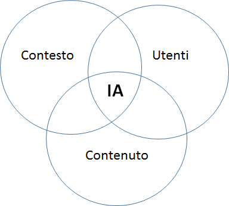

Architettura dell'informazione
------------------------------

L’architettura dell’informazione consiste nell’organizzazione semantica
e logica di ambienti informativi, sia fisici sia digitali, e serve 
a rendere i servizi pubblici più facili da trovare, da capire e da usare. 
Una buona architettura dell'informazione aiuta le persone a comprendere 
ciò che le circonda e a trovare ciò che cercano, sia online che offline. 
Lavorare su questo ambito implica una seria riflessione sulla struttura 
dell'informazione e sul linguaggio. L’architettura dell’informazione è 
più efficace se è progettata intorno ai reali bisogni delle persone: 
per questo si parla di *user-centered design*.

Nel corso dei prossimi mesi pubblicheremo, secondo `roadmap
<https://designers.italia.it/content-design/>`_, 
alcuni approfondimenti relativi a tutti i principali temi legati 
all’architettura dell’informazione e in particolare: la prototipazione, 
attraverso il wireframing e l’interactive wireframing; le strutture di 
navigazione; le logiche di classificazione dei contenuti e le relazioni 
tra contenuti; la progettazione di interazioni specifiche come la home 
page di un sito web e la pagina di ricerca.

L’ambito
~~~~~~~~

Per progettare l’architettura dell’informazione di un ambiente
informativo è necessario analizzare:

-  gli utenti
-  i contenuti
-  il contesto

Il processo di progettazione dell’architettura dell’informazione di un
sito web parte dall'analisi degli utenti, del contenuto del sito e del
contesto nel quale si opera. Questo processo porta all’individuazione
dei contenuti imprescindibili del progetto web.

   Architettura dell'informazione

Progettare l’architettura dell’informazione significa soddisfare i
bisogni degli utenti, creando contenuti utili e rilevanti che possano
adattarsi al contesto di fruizione. Grazie alla ricerca sugli utenti e
all’analisi del contesto, è possibile definire le funzioni principali
del sito e di ogni sua pagina. I contenuti diventano quindi parte
integrante del servizio all’utente.

Ecco, a titolo di esempio, alcune delle macro funzioni tipiche di un sito pubblico: 

- identificare l'utente
- consentire la prenotazione/iscrizione
- consentire il pagamento (e più in generale, scambiare denaro)
- informare, regolamentare
- interagire, comunicare con l'utente
- archiviare/conservare informazioni
- proporre un lavoro a persone e aziende
- autorizzare l'utente a fare qualcosa

Gli utenti
~~~~~~~~~~

L'analisi delle esigenze informative e dei comportamenti di navigazione
degli utenti contribuisce alla progettazione di un’efficace architettura
dell’informazione. Per analizzare il tipo di pubblico del sito web è
necessario definire:

-  i target principali a cui si rivolge l'informazione o il servizio
-  i bisogni, ovvero le necessità informative e operative degli utenti
-  le principali attività che gli utenti intendono effettuare

È bene prendere decisioni sulla base dell’analisi dei dati riferiti
all’utente in particolare i dati statistici di navigazione sul sito per
comprendere il comportamento dell’utente la realizzazione di interviste
e altri metodi di analisi qualitativa l’esperienza e la competenza
generale di navigazione dell'utente target.

Il contenuto
~~~~~~~~~~~~

Per contenuto si intendono le informazioni veicolate da documenti,
applicazioni, servizi e metadati che si trovano all’interno del sito web
o che verranno creati in futuro. Per analizzare il contenuto disponibile
e per progettare i contenuti da sviluppare è necessario definire:

-  i documenti/dati disponibili
-  le tipologie dei documenti/dati
-  l’oggetto dei contenuti disponibili
-  l’aggiornamento dei documenti disponibili
-  la quantità dei contenuti disponibili
-  le strutture esistenti
-  l’ownership dei contenuti
-  i metadati
-  i formati
-  il tasso di crescita previsto

Spesso l’esito di questa analisi determina quella che viene definita una
gap analysis, che evidenzia i contenuti presenti attualmente sul sito e
quelli che dovranno essere prodotti / modificati / eliminati nella nuova
versione del sito.

Il contesto
~~~~~~~~~~~

Nella progettazione di un sito web, l’architettura dell’informazione
deve necessariamente adattarsi al contesto di riferimento, per essere
coerente con gli obiettivi, la strategia e la “cultura”
dell’organizzazione. Per analizzare il contesto è necessario quindi
considerare e definire:

-  Gli obiettivi strategici dell’Amministrazione
-  Le risorse economiche disponibili
-  Le direttive/norme vigenti che vincolano il progetto
-  la “cultura” dell’amministrazione, intesa anche come la propensione
   al cambiamento
-  l’ambito tecnologico
-  le risorse umane coinvolte nel progetto, e le loro competenze
   tecniche
-  i limiti operativi, relativi ad esempio alla logistica, alla
   sicurezza

Dai bisogni degli utenti alle funzioni di un servizio digitale
~~~~~~~~~~~~~~~~~~~~~~~~~~~~~~~~~~~~~~~~~~~~~~~~~~~~~~~~~~~~~~

La progettazione dell’architettura dell’informazione di un ambiente 
digitale si fonda su alcune conoscenze relative al contesto e alle
persone che usano il servizio, che possono essere sintetizzate in 
alcuni strumenti operativi, descritti nella sezione dedicata al 
`service design <https://design-italia.readthedocs.io/it/stable/doc/service-design.html>`_:

-  **personas**: profili verosimili di utenti del servizio delineati in
   base ai risultati della ricerca, rappresentativi di un gruppo di 
   utenti (approfondisci: `Kit Personas <https://designers.italia.it/kit/personas/>`_); 
-  **user stories** e **scenari** (azioni e circostanze in cui l'utente
   si trova a prendere decisioni e a effettuare scelte che lo portano a 
   interagire con l'ambiente e le informazioni per raggiungere un obiettivo); 
-  **journey map** (rappresentazione del percorso compiuto dall'utente 
   interagendo con i *touchpoint* fisici o digitali del servizio, elaborate
   a partire da *personas* e *user stories*).

Questi elementi ci aiutano a concentrarci sugli utilizzatori del servizio, 
assumere il loro punto di vista e avere una lista chiara dei loro bisogni 
(evidenziando priorità e possibili criticità).

Le funzioni di un sito o di un servizio digitale
^^^^^^^^^^^^^^^^^^^^^^^^^^^^^^^^^^^^^^^^^^^^^^^^

I siti web non sono tutti uguali, e il motivo è che assolvono a funzioni 
diverse: alcuni hanno come scopo principale vendere un prodotto, altri 
servono ad aggiornare l’utente con notizie dell’ultim’ora, altri ancora 
consentono di consultare l’estratto conto bancario o la propria posizione 
pensionistica. Analizzando le funzioni dei siti web è possibile raggrupparli
in famiglie o tipologie di siti.

Quello di “funzioni narrative” è un concetto che l’architettura dell’informazione
mutua dalla teoria del testo, dalla semiotica e dalla linguistica ed è molto utile
per mettere a fuoco su cosa deve puntare il nostro sito e a quale famiglia di siti
deve ispirarsi. Le “funzioni” non sono altro che le azioni principali che gli utilizzatori
del sito web (le *personas* descritte in precedenza) vogliono o devono compiere.

Stabilire le priorità
^^^^^^^^^^^^^^^^^^^^^

Dopo aver capito il concetto di funzioni, il gioco è tutto nell’avere un forte
senso delle priorità. Se siamo bravi a chiarire le due o tre funzioni principali
del nostro sito, il lavoro di progettazione procederà spedito ed eviteremo errori
grossolani o fraintendimenti. Per esempio: se la funzione principale di un sito web
è permettere la consultazione di un vasto catalogo di *open data*, la progettazione
del motore di ricerca dovrà avere estrema importanza sia in termini di *user experience*
sia in termini di investimenti tecnologici.

Avere le idee chiare sulle funzioni che dovrà avere il nostro sito ci permette anche 
di individuare due o tre siti web “giusti” da analizzare e da cui trarre ispirazione 
senza disperdere energie nella consultazione di decine di siti o app. Trovare i giusti 
esempi da analizzare può portare a risparmiare diversi giorni o anche settimane nel 
processo di progettazione.

Definire la funzione principale
^^^^^^^^^^^^^^^^^^^^^^^^^^^^^^^

Lo sforzo linguistico necessario per esprimere in un'unica frase quale sia la funzione 
principale del servizio che si sta realizzando è il modo più efficace per non perdere 
di vista l'obiettivo nelle successive fasi di progettazione. Sarà anche un utile 
criterio per valutare l'efficacia del lavoro, una volta terminato. 

Per esempio, applicando questo metodo al sito `OpenCantieri <http://opencantieri.mit.gov.it/>`_ 
potremmo dire che la funzione principale a cui assolve il sito è presentare un’informazione aperta, 
completa e aggiornata sul processo di realizzazione delle infrastrutture pubbliche.

Individuare le funzioni a partire dalla lista dei bisogni
^^^^^^^^^^^^^^^^^^^^^^^^^^^^^^^^^^^^^^^^^^^^^^^^^^^^^^^^^

Le funzioni di un sito web servono a rispondere ai bisogni degli utenti. Un modo semplice 
per mapparle è creare una tabella che mette in relazione bisogni e funzioni. Nel formulare 
le funzioni occorre tenere presente che si tratta di azioni: per essere sicuri di individuarle 
e formularle in modo corretto può essere una buona strategia iniziare le frasi con un verbo.

Per esempio: se uno dei bisogni individuato è “come cambiare l’indirizzo di residenza”, 
una funzione potrebbe essere “mostrare la lista dei servizi dell’anagrafe relativi alla 
residenza”.

+--------------------------------------+--------------------------------------------+
|Bisogni                               |Funzioni                                    | 
+======================================+============================================+
|Come cambiare l’indirizzo di residenza|Mostrare la lista dei *servizi*             | 
|                                      |dell’*anagrafe* relativi alla *residenza*   |                
+--------------------------------------+--------------------------------------------+
|Trovare gli orari di apertura al      |Mostrare una vista sintetica con le         |
|pubblico degli uffici per cambiare    |*informazioni di contatto* dell'ufficio     |
|l'indirizzo di residenza              |*anagrafe*                                  |
+--------------------------------------+--------------------------------------------+

Una volta individuate le macro-funzioni per la lista dei bisogni, si può procedere con 
l’individuazione delle sotto-funzioni, che descrivono in maniera più puntuale le azioni 
che il sistema dovrà compiere per completare una macro-funzione.

+--------------------------+------------------------------+----------------------------+
|Bisogni                   |Macro-Funzioni                |Sotto-Funzioni              |
+==========================+==============================+============================+
|Come cambiare l’indirizzo |Mostrare la lista dei servizi | -  Individua i servizi     |
|di residenza              |dell’anagrafe relativi        |    relativi                |
|                          |alla residenza                |    all’area anagrafe       |
|                          |                              | -  Seleziona i servizi     |
|                          |                              |    dell'area anagrafe      |
|                          |                              |    relativi alla residenza |
|                          |                              | -  Estrae i titoli dei     |
|                          |                              |    contenuti individuati e |
|                          |                              |    mostra una lista in     |
|                          |                              |    ordine alfabetico       |
+--------------------------+------------------------------+----------------------------+
|Trovare gli orari di      |Mostrare una vista sintetica  | -  Individua i contatti    |
|apertura al pubblico      |con tutte le informazioni     |    associati all'ufficio   |
|degli uffici per cambiare |di contatto dell’ufficio      |    specificato             |
|l’indirizzo di residenza  |anagrafe                      | -  Individua gli orari     |
|                          |                              |    associati al            |
|                          |                              |    determinato ufficio     |
|                          |                              | -  Estrae il titolo        |
|                          |                              |    dal nome dell'ufficio   |
|                          |                              |    selezionato e mostra    |
|                          |                              |    una vista con tutti     |
|                          |                              |    i contenuti             |
+--------------------------+------------------------------+----------------------------+

Individuare le funzioni di front end e back end
^^^^^^^^^^^^^^^^^^^^^^^^^^^^^^^^^^^^^^^^^^^^^^^

Le pagine di un sito sono i luoghi in cui le persone interagiscono con il sistema (**front end**); 
il **back end** è il luogo in cui è possibile gestire i contenuti, i frutti delle interazioni, 
e amministrare le informazioni destinate al *front end*. Quando si arriva alla definizione delle 
sotto-funzioni, come nella tabella precedente, si stanno definendo alcune azioni che si potranno 
compiere nel front end. 

Per cominciare a delineare le funzioni del *back end* la domanda da porsi è: "cosa deve succedere 
nel *back end* perché nel *front end* sia possibile una determinata azione?".

+--------------+------------------------+----------------------------+--------------------+
|Bisogni       |Funzioni                |Front End                   |Back End            |
+==============+========================+============================+====================+
|Come cambiare |Mostrare la lista       | -  Individua i servizi     | - Permette di      |
|l'indirizzo   |dei servizi             |    relativi                |   associare dei    |
|di residenza  |dell’anagrafe relativi  |    all’area *anagrafe*     |   contenuti alla   |
|              |alla residenza          | -  Seleziona i servizi     |   categoria        |
|              |                        |    dell'area *anagrafe*    |   *anagrafe*       |
|              |                        |    relativi alla residenza | - Ordina in ordine |
|              |                        | -  Estrae i titoli dei     |   alfabetico       |
|              |                        |    contenuti individuati e |   crescente i      |
|              |                        |    mostra una lista in     |   contenuti in base|
|              |                        |    ordine alfabetico       |   al titolo        |
+--------------+------------------------+----------------------------+--------------------+
|Trovare gli   |Mostrare una vista      | -  Individua i contatti    | - Permette di      |
|orari di      |sintetica con tutte le  |    associati all'ufficio   |   associare dei    | 
|apertura al   |informazioni di contatto|    specificato             |   contatti         |  
|pubblico degli|dell'ufficio anagrafe   | -  Individua gli orari     |   all'ufficio      |
|uffici per    |                        |    associati al            |   selezionato      |
|cambiare      |                        |    determinato ufficio     | - ...              |
|l'indirizzo di|                        | -  Estrae il titolo dal    |                    |
|residenza     |                        |    nome dell'ufficio       |                    |
|              |                        |    selezionato e mostra    |                    |
|              |                        |    una vista con tutti i   |                    |
|              |                        |    contenuti               |                    |   
+--------------+------------------------+----------------------------+--------------------+
