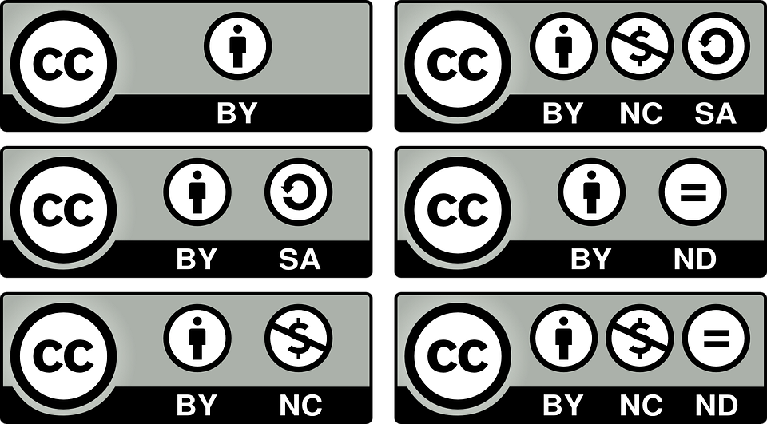
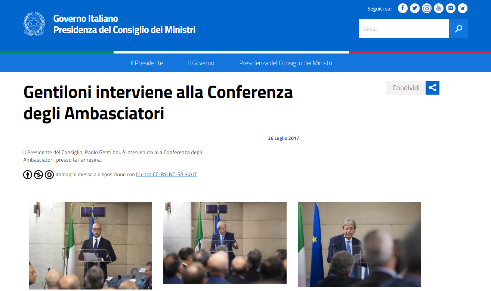
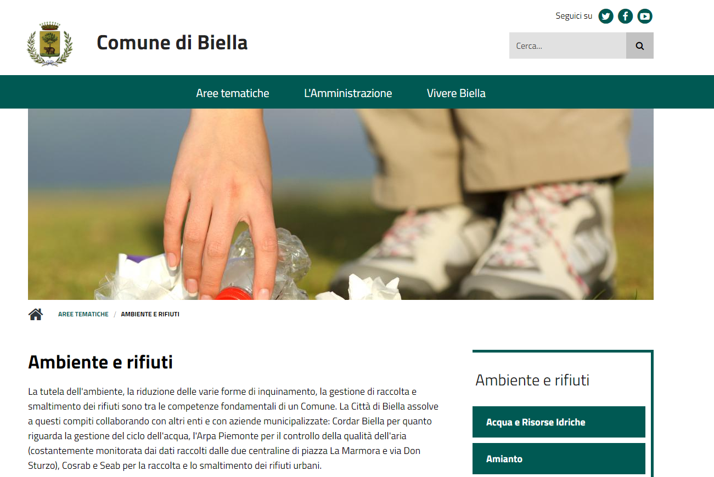

Linguaggio
----------

Gestione dei contenuti
~~~~~~~~~~~~~~~~~~~~~~

I contenuti di un sito web devono consentire all'utente di trovare
velocemente l'informazione di cui ha bisogno, nel formato di fruizione
più idoneo, anche mediante un dispositivo mobile.

.. admonition:: SI DEVE

   Progettare i contenuti affinché rispondano innanzitutto alle necessità
   degli utenti, non solo a quelle dell'amministrazione.

Nella pianificazione e progettazione di un contenuto web, considera che
le persone spesso utilizzano il *mobile* anche quando hanno la
possibilità di navigare tramite il desktop. Nella gestione dei contenuti
verifica quindi se sia possibile:

- ridurre la quantità complessiva del testo previsto per la pubblicazione
  online;
- utilizzare una tipologia di formato del contenuto che sia più fruibile
  in relazione agli obiettivi informativi, ad es. evitare i pdf;
- rimuovere il contenuto superfluo presente sul sito.

Creazione dei contenuti
~~~~~~~~~~~~~~~~~~~~~~~

Ogni singolo paragrafo, ogni singola parola devono venire incontro alle
necessità informative degli utenti e consentire loro di trovare con
immediatezza ciò che cercano. Dovresti quindi almeno:

- utilizzare titoli e sottotitoli nelle pagine;
- scrivere frasi brevi;
- suddividere il contenuto per paragrafi;
- monitorare costantemente l’aggiornamento dei contenuti.

.. admonition:: SI DOVREBBE

   Strutturare il contenuto in modo che le informazioni più importanti
   compaiano nella prima parte del corpo del testo.
   Ogni paragrafo dovrebbe veicolare un solo concetto per volta. 

Linguaggio
~~~~~~~~~~

È necessario usare un linguaggio chiaro e sintetico, finalizzato a
indirizzare l'utente verso l'informazione o il servizio di cui ha
bisogno.

.. admonition:: SI DOVREBBE

   Si dovrebbe evitare l’utilizzo di un linguaggio gergale e specialistico
   o l’uso di termini e frasi di difficile comprensione.

Utilizzare quindi:

- preferibilmente la forma attiva dei verbi;
- un vocabolario semplice e chiaro, privilegiando termini e frasi che gli
  utenti potrebbero usare nella ricerca online;
- fornire una spiegazione dei termini tecnici presenti;
- esplicitare gli acronimi e le abbreviazioni, inserendo l'acronimo tra
  parentesi tonde dopo il termine indicato per esteso.

Corretta ortografia
~~~~~~~~~~~~~~~~~~~

Usa particolare attenzione alla corretta ortografia della lingua
italiana, soprattutto per quanto riguarda l’uso degli accenti e degli
apostrofi.

Titoli
~~~~~~

Il titolo deve anticipare sinteticamente all'utente il contenuto della
pagina.

.. admonition:: SI DOVREBBE

   Per essere ben visibili nei risultati dei motori di ricerca, la lunghezza
   dei titoli delle pagine dovrebbe essere compresa fra i 50 e i 65 caratteri,
   spazi compresi.

Per creare titoli che attirino l’attenzione del lettore:

- scrivere titoli unici all'interno del sito, e non ambigui;
- utilizzare le parole più rappresentative del contenuto a cui il titolo fa
  riferimento;
- non scrivere il titolo in maiuscolo, poiché rende la lettura più faticosa;
- non utilizzare punti alla fine del titolo;
- mettere graficamente in risalto i titoli rispetto al testo circostante;
- non inserire slash / o trattini;
- non utilizzare acronimi, a meno che non siano ben noti (es. UE).

Sommario
~~~~~~~~

.. admonition:: SI DOVREBBE

   Il sommario delle notizie in home page dovrebbe essere un periodo
   di senso compiuto, senza puntini di sospensione alla fine.

Il sommario serve a sintetizzare al lettore l’oggetto dell’articolo,
prima della selezione della pagina di dettaglio. Dovrebbe quindi avere
una lunghezza massima di 140 caratteri, spazi inclusi, e possedere le
seguenti caratteristiche:

-  essere una sintesi dei punti centrali del contenuto;
-  essere diverso dal titolo e dalle prime righe del contenuto della
   pagina interna;
-  contenere le parole chiave più rappresentative del contenuto;
-  terminare con un punto.

Testo della pagina
~~~~~~~~~~~~~~~~~~

Specialmente nel caso delle notizie, il testo deve rispondere
sinteticamente alle cinque domande: chi, dove, quando, perché, come.

-  Il testo di un contenuto deve essere il più coerente possibile con
   titolo e il sommario;
-  Ogni paragrafo deve contenere al massimo 3 frasi;
-  Il testo della pagina deve contenere le parole chiave riportate nel
   titolo e nel sommario;
-  Utilizzare liste puntate per elencare concetti costituiti da tre o
   più elementi.

Creazione dei link
~~~~~~~~~~~~~~~~~~

.. admonition:: SI DEVE

   I link devono essere costituiti da parole-chiave significative.
   Non usare mai la frase “clicca qui” per attivare un link.

Per individuare quali parole deve contenere un link è bene pensare alle
parole chiave che un utente userebbe in un motore di ricerca per trovare
il contenuto al quale rimanda il link che si sta costruendo. I link
devono contenere parole significative rispetto al contenuto a cui
rinviano e non devono essere presenti nel sommario. Anziché duplicare
informazioni all'interno di sezioni diverse del sito, è preferibile
attivare dei link di approfondimento per collegare fra loro contenuti
che trattano tematiche complementari. I link verso l’esterno del sito
dovrebbero essere accompagnati da un avviso leggibile anche dagli screen
reader (ad esempio “Questo link si aprirà in una nuova finestra”).
Verifica periodicamente i link esterni, per evitare che rimandino a
pagine inesistenti o non aggiornate.

Link di navigazione e bottoni
~~~~~~~~~~~~~~~~~~~~~~~~~~~~~

Nel definire le voci dei link presenti nei menu di si deve usare una
terminologia univoca, dove la stessa definizione non conduca, in luoghi
diversi, ad azioni differenti. Nei bottoni e nei link descrivere in modo
coerente e puntuale quali sono le azioni che ci dobbiamo aspettare
nell’eseguire un comando o nel riempire un form. Siate specifici:
“Cerca” invece di “Invia”, “Paga” invece di “Ok”. Il significato di
“Cancella” è diverso da “Annulla”.

Immagini
~~~~~~~~

Come ogni contenuto che pubblichiamo sul web, 
ci vuole buon senso anche nella pubblicazione di immagini. 
Non pubblicare foto inutili, non pubblicare sequenze di foto 
simili tra loro se non aggiungono significato, non pubblicare foto 
troppo pesanti. Dedica tempo alla produzione, alla ricerca e 
alla selezione delle immagini: una buona foto può fare la differenza
e dare grande valore al tuo contenuto.

Ricordati di: 

- accompagnare ogni foto con una didascalia; 
- citare l’autore; 
- riportare la licenza di pubblicazione. 

Infine, quando pubblichi un’immagine, assicurati che il file 
dell’immagine abbia un nome che riflette il contenuto dell’immagine 
(per esempio, se pubblichi una foto del Teatro antico di Taormina 
il nome del file potrebbe essere teatro-antico-taormina.jpg): 
tra le altre cose, sarà più facile per i motori di ricerca 
indicizzare il tuo contenuto e per gli utenti trovarlo.

Dimensione delle immagini 
^^^^^^^^^^^^^^^^^^^^^^^^^

Le dimensioni delle immagini influenzano la velocità di caricamento 
della pagina: è quindi fondamentale rispettare alcune buone pratiche 
per tenere sotto controllo peso, risoluzione e proporzioni del file.

Partiamo da un esempio: le immagini utilizzate per le card nella pagina
dei `progetti <https://designers.italia.it/progetti/>`_
del sito Designers. Per garantire una resa adeguata 
delle immagini, dato il template responsive (cioè che adatta il formato 
in base al dispositivo), sono state utilizzate immagini le cui dimensioni
originali sono 800x450 con una risoluzione di 72ppi.

Prima di pubblicare un’immagine è opportuno verificare che sia ottimizzata
per il web:

- Risoluzione: 72 ppi
- Formato: JPG (JPEG), PNG
- Modello di colori: RBG 

In generale, se le dimensioni originali dell’immagine possono variare, 
è consigliabile effettuare sempre un `ricampionamento <https://helpx.adobe.com/it/photoshop/using/image-size-resolution.html#resampling]>`_ 
delle immagini, di modo che mantengano una buona definizione 
ma abbiano una dimensione ridotta in termini di byte 
(e in genere anche in pixel).

Se hai la necessità di fare semplici modifiche alle immagini 
(correggere le dimensioni o la luminosità, ritagliare, ruotare, etc.) 
puoi sfruttare alcuni servizi online gratuiti:

- `Photoshop Express Editor <http://www.photoshop.com/tools?wf=editor>`_
- `Google Nik Collection <https://www.google.com/nikcollection/>`_
- `Pixlr Express <https://pixlr.com/express/>`_
- `Fotor <http://www.fotor.com/>`_

Archiviazione
^^^^^^^^^^^^^

È una buona pratica organizzarsi in modo da avere un archivio delle 
immagini funzionale e ordinato. A questo scopo sarebbe opportuno:

- nominare i file di modo che contengano keyword relative all’oggetto 
  della foto e la data di acquisizione o comunque in maniera uniforme;
- organizzare le foto in cartelle per tema o evento;
- utilizzare i tag, pensando a possibili utilizzi alternativi per una 
  stessa foto; 
- effettuare un backup periodico delle immagini.

Licenze
^^^^^^^

.. admonition:: SI DEVE

   Il `copyright <https://it.wikipedia.org/wiki/Copyright>`_
   è un metodo di riconoscimento e tutela del diritto d’autore
   sulle immagini. Se intendi utilizzare immagini protette da copyright è 
   necessario richiedere l’autorizzazione al proprietario, e conoscere i 
   termini d’uso concessi. 

Con lo sviluppo del Web hanno avuto grande diffusione le licenze di tipo 
`Creative Commons (CC) <http://www.creativecommons.it/Licenze>`_: 
un modo standardizzato per definire a quali diritti l’autore rinuncia 
e quali si riserva: le sei licenze CC richiedono, in tutti casi, 
l'attribuzione al proprietario dei diritti e specificano diversamente 
alcune possibilità di utilizzo (opere derivate, usi commerciali, 
possibilità di modifica del contenuto).

In pratica, se un’immagine ha una licenza CC un utente può utilizzarla
senza dover chiedere l’autorizzazione al proprietario e limitandosi 
ad attribuirgliene i diritti in modo esplicito. È importante verificare 
e rispettare i limiti di utilizzo dell’immagine consentiti dalla specifica 
licenza CC: alcune non consentono una modifica del contenuto, 
altre non consentono l’uso commerciale, ecc. 

   
   I loghi delle sei licenze CC

Approfondimenti: `Wikipedia su Creative Commons <https://it.wikipedia.org/wiki/Creative_Commons#Le_licenze>`_
 

Di seguito un esempio di rilascio delle immagini con licenze 
Creative Commons. Le foto della gallery sono utilizzabili a queste 
condizioni: attribuzione al proprietario, uso non commerciale 
e condivisione con la stessa licenza (licenza CC-BY-NC-SA 3.0 IT).

  
   Gallery di immagini con licenze CC - fonte: `Governo.it <http://www.governo.it/media/gentiloni-interviene-alla-conferenza-degli-ambasciatori/7869>`_

Archivi di immagini online
^^^^^^^^^^^^^^^^^^^^^^^^^^

È possibile trovare online archivi di immagini gratuite con licenze 
di utilizzo estremamente aperte, che non richiedono alcuna attribuzione 
(es. `Unsplash <https://unsplash.com/>`_
e le relative informazioni sul `tipo di licenza offerta <https://unsplash.com/license>`_).
Altre fonti possibili sono per esempio 
`Google Images <https://www.google.com/advanced_image_search>`_
, `Flickr <https://www.flickr.com/>`_
e `Getty Images <http://www.gettyimages.it/>`_
in cui usando la ricerca avanzata è possibile ricercare immagini in base 
alla licenza applicata e individuare in questo modo immagini utilizzabili 
senza dover richiedere consenso scritto all’autore. Un altro servizio utile 
è `CC search <https://search.creativecommons.org/>`_, motore di ricerca di immagini
con ricerca Creative Commons.

Di seguito un esempio di utilizzo di un'immagine ripresa da un archivio online:

   Esempio immagine da archivio iStockPhoto - fonte: `Comune di Biella <https://www.comune.biella.it/web/aree-tematiche/ambiente-e-rifiuti>`_
 

Approfondimenti: `come trovare immagini liberamente utilizzabili attraverso Google Images. <https://support.google.com/websearch/answer/29508>`_

Immagini prese dai social network
^^^^^^^^^^^^^^^^^^^^^^^^^^^^^^^^^

I canali social (in particolare Facebook e Instagram) sono una rilevante fonte di immagini e contenuti multimediali, realizzati dagli utenti e caricati sui propri profili. La pubblicazione di una foto su un profilo social non è però **via libera all'utilizzo indiscriminato** da parte di chiunque. Il comportamento da tenere nei confronti di quella immagine è lo stesso che si deve tenere nei confronti di un'immagine raccolta da un blog o un qualsiasi sito, ovvero assicurarsi di avere **tutti i diritti di utilizzo** concessi espressamente (anche a titolo gratuito) dall'autore o il detentore dei diritti, che può essere chi ha pubblicato quella foto sul proprio canale social o può essere un altro soggetto.

Consenso dei soggetti ritratti
^^^^^^^^^^^^^^^^^^^^^^^^^^^^^^

Un altro tema da tenere in considerazione quando si pubblicano immagini all'interno di un sito è il **consenso alla pubblicazione** da parte dei soggetti ritratti all'interno delle fotografie.

In caso di fotografie provenienti da **archivi online** gratuiti o a pagamento, si può dare per acquisito che chi ha realizzato l'immagine o l'ha pubblicata si sia assicurato il consenso dei soggetti ritratti.

Nel caso di fotografie realizzate autonomamente, **il consenso è invece necessario nella maggior parte dei casi**. Fanno eccezione le persone ritratte in **eventi di pubblico interesse** (una conferenza stampa, una manifestazione in piazza, una concerto) e le **persone famose** (in base al pubblico interesse, quindi ad esempio esponenti delle istituzioni, attori, personaggi pubblici), purché in contesti pubblici: in questi casi le fotografie si possono utilizzare senza una specifica autorizzazione. Altre eccezioni, previste per legge, sono “scopi di polizia, di giustizia, didattici o scientifici”.

In tutti gli altri casi, per evitare violazioni della privacy, la pubblicazione di fotografie in un sito deve essere sempre autorizzata dai soggetti ritratti con una **lettera liberatoria** (di cui si trovano `numerosi modelli online <http://documentiutili.com/fac-simile-liberatoria-fotografica>`_), in cui si deve specificare l'utilizzo cui la foto è destinata (ad esempio, pubblicazione online sul blog dell'Ente).

.. admonition:: SI DEVE

   Nel caso di foto che ritraggono **minori** (si pensi ad esempio alla pubblicazione 
   sul sito di una scuola delle foto di una recita) è sempre necessaria 
   l'autorizzazione scritta da parte di un adulto che abbia il diritto 
   a concederla (ad esempio un genitore o un tutore).
