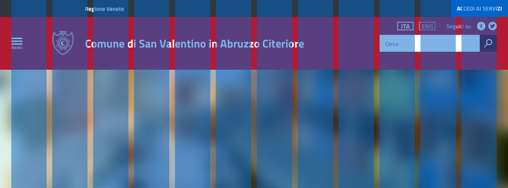
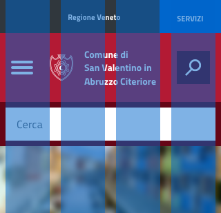
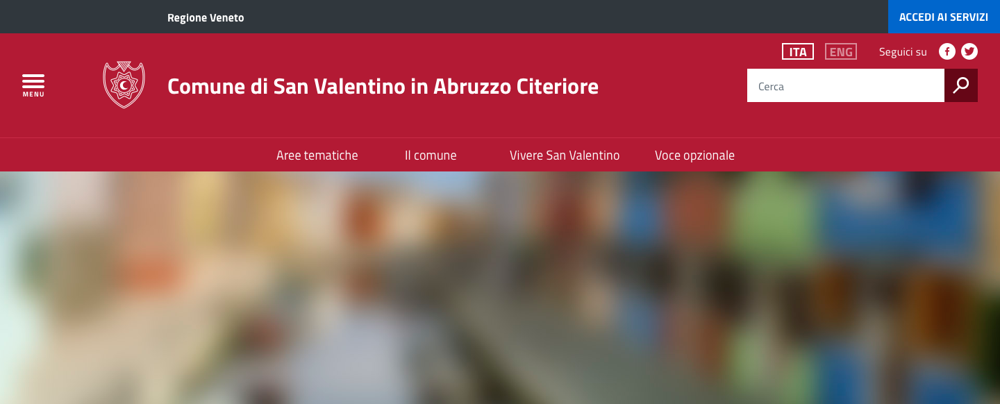
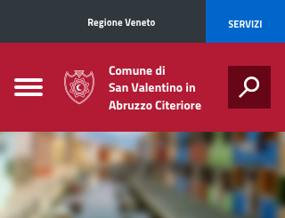

User interface
==============

User interface, interfaccia utente, è tutto quello che fa da ponte
fra i servizi digitali ed i loro destinatari. Sono i cosiddetti
Touch Point di un servizio digitale. Non pensiamo all’interfaccia solo
come ad una serie di elementi grafici e visuali, ma come a tutto quello
con cui l’utente entra in relazione, nei vari contesti, per usare un
servizio o un prodotto digitale. 

In questa fase delle linee guida ci concentriamo sugli elementi più classici
dell’interfaccia, definendo alcuni principi di visual design, alcuni elementi
di style, degli esempi di layout o presentazione dei contenuti e alcun
pattern (componenti), i mattoni veri e propri dell’interfaccia.

Presto alcune di queste sezioni verranno ampliate ed arricchite. 

Abbiamo proposto alcuni strumenti operativi (bricks) e di checklist rapide per
completare le linee guida e per fornire dei suggerimenti operativi.
Inoltre trovate un UI-kit di base e un Icon Kit per iniziare una prototipazione di base. 
Le trovate su `https://designers.italia.it/it/user-interface/
<https://designers.italia.it/it/user-interface/>`__
 
Per chi vuole invece iniziare a scrivere codice, la reference implementation delle
linee guida o cosiddetto web-toolkit, è qui `https://italia.github.io/ita-web-toolkit/ 
<https://italia.github.io/ita-web-toolkit/>`__
 
Uno spazio di discussione dedicato alla user interface e aperto al contributo di tutti
è stato predisposto su `https://forum.italia.it/c/design/user-interface
<https://forum.italia.it/c/design/user-interface>`__

Principi
--------

Mobile first
~~~~~~~~~~~~

L'approccio *mobile first* consiste nel **valutare in prima istanza la
resa sui dispositivi mobili**, per poi arricchire di elementi e
funzionalità la composizione della pagina mano a mano che la viewport
aumenta.

Responsive Web Design
^^^^^^^^^^^^^^^^^^^^^

.. admonition:: SI DEVE

   Il sito web deve essere progettato e sviluppato con un approccio *responsive*
   con l'obiettivo di rendere disponibile un'ottimale esperienza di visione all'utente,
   facilità di lettura e navigazione con minime necessità di ridimensionare, spostare o
   scorrere, su qualunque dispositivo indipendentemente dalla risoluzione e dalla
   dimensione dello schermo.

Nell'approccio mobile first si parte dall'essenziale.

Obbligarsi a progettare un'applicazione con ridotte disponibilità di
spazio, di interazione, di velocità di caricamento costringe a stabilire
delle priorità e a fare delle scelte che risulteranno utili
all'usabilità del prodotto.

Man mano che lo schermo si fa più grande e il collegamento più veloce, i
contenuti vengono arricchiti. Un utente seduto alla scrivania con un
computer ha probabilmente più tempo e più possibilità di approfondire e
navigare. Un utente collegato da smartphone ha forse l'urgenza di
cercare quel contenuto dal luogo in cui si trova, senza aspettare di
tornare a casa e arrivando all'essenziale il più velocemente possibile.

I contenuti e le funzionalità di un sito o un servizio devono poter
essere fruibili su tutti i dispositivi più utilizzati dagli utenti.

.. admonition:: SI DOVREBBE

   Analizzare regolarmente l'utilizzo dei dispositivi e delle diverse risoluzioni
   che gli utenti adoperano per accedere al sito.

È necessario assicurare la compatibilità con almeno i seguenti browser:

-  Internet Explorer 10+
-  Edge 12+
-  Safari 8+
-  Google Chrome (ultime versioni)
-  Opera (ultime versioni)
-  Mozilla Firefox (ultime versioni)
-  IE Mobile 10+
-  iOS Safari 8+ (versione del sistema operativo)
-  Android Browser 4+ (versione del sistema operativo)

La lista comprende più del 95% delle versioni utilizzate in Italia (e
nel mondo) secondo i dati raccolti da
`StatCounter <http://gs.statcounter.com/#browser-IT-monthly-201506-201606>`__

Non è necessario che l'aspetto del sito sia identico sui diversi
dispositivi; va tuttavia garantita un'esperienza utente equivalente.

Garantire la compatibilità
~~~~~~~~~~~~~~~~~~~~~~~~~~

Nel web design si sono adottati spesso gli approcci **graceful
degradation** (decadimento parziale) o **progressive enhancement**
(miglioramento progressivo). Si tratta di due risposte diverse alla
stessa esigenza: rendere il contenuto accessibile su dispositivi
diversi. Nel primo approccio ci si fa carico di verificare che il
progetto, inizialmente pensato per i dispositivi più completi, resti
navigabile anche man mano che si usano tecnologie più obsolete o meno
interattive. Nel secondo, si parte da un nucleo solido e irrinunciabile
di contenuti che vengono arricchiti via via che il dispositivo diventa
più potente e all'avanguardia.

Tecnicamente il sito web può rilevare quale dispositivo lo sta
navigando. È possibile capire: - lo **user agent**, ovvero quale browser
e quale sistema operativo è in collegamento - la **risoluzione** dello
schermo, ovvero quanti pixel abbiamo a disposizione - il **tipo di
media**, ovvero se stiamo andando in stampa o su schermo

Tecniche apposite come l'uso di **media queries** permettono di inserire
istruzioni nei CSS affinché la presentazione dei contenuti sia calibrata
sull'attuale dimensione della viewport.

Validazione dei fogli di stile CSS
~~~~~~~~~~~~~~~~~~~~~~~~~~~~~~~~~~

Per compensare le incompatibilità dei diversi browser è spesso
necessario introdurre nei fogli di stile (CSS) codice non conforme; di
conseguenza i risutati del `test di validazione del
W3C <https://jigsaw.w3.org/css-validator/>`__ riportano degli errori.

La validazione è importante laddove tali errori pregiudicano una
funzionalità; oggi i browser sono più "resilienti" e spesso non si
verifica il caso.

Non è necessario pertanto che un CSS rientri perfettamente negli
standard.

La validazione del CSS non è inoltre sufficiente a garantire
l'`accessibilità <service-design.html#accessibilita>`__.

Stile
-----

Layout
------

.. admonition:: SI DOVREBBE
   
   Utilizzare un layout essenziale.

L'impaginazione dei contenuti tramite un layout lineare (una o due
colonne) favorisce la **rapida scansione delle informazioni** e ne
agevola la consultazione soprattutto su *touchscreen*, dove il pattern
di interazione più funzionale è lo scorrimento verticale della pagina.

Casi d’uso validi per l’utilizzo di **una colonna laterale** (
``<nav>``, ``<aside>``) sono tutti e solo quelli dove sussiste
un’immediata correlazione semantica con il contenuto principale:

-  menu contestuale della sezione del sito correntemente visualizzata
-  elenco di sezioni / contenuti / documenti correlati

.. admonition:: SI PUÒ

   Elenchi di contenuti omogenei (ad esempio: anteprime di notizie o eventi)
   possono essere presentati tramite **card** o liste posizionate in una
   `griglia responsive <user-interface.html#griglie>`_.

L'utilizzo di card favorisce la consultazione dei contenuti sugli
schermi più piccoli.

Più in generale, laddove i dati non hanno una struttura prevalentemente
tabulare, è consigliato l'utilizzo di card o liste al posto che di
tabelle (``table``) che risultano più difficili da rendere fruibili in
maniera efficace sui dispositivi mobili.

Gerarchia dei contenuti
~~~~~~~~~~~~~~~~~~~~~~~

.. admonition:: SI DEVE
   
   Per una corretta definizione della struttura gerarchica dei contenuti,
   la suddivisione in parti deve essere espressa attraverso l’uso dei tag
   semantici disponibili in HTML5, quali ``<article>, <aside>, <figcaption>,
   <header>, <footer>``, ecc., al posto del generico divisore ``<div>``.

Griglie
~~~~~~~

All’interno dello spazio a disposizione l’organizzazione del contenuto
deve essere strutturata seguendo un sistema di **griglie responsive**
per mantenere una efficace esperienza utente trasversalmente ai
dispositivi utilizzati.

La griglia rappresenta la struttura invisibile che permette di
organizzare i contenuti della pagina. Una griglia di impaginazione
consiste in **colonne** di testo (e/o immagini) separate da spazi
intercolonna e contornate dai margini della pagina.

Le dimensioni delle colonne vanno adattate ai cambiamenti della
viewport: ogni colonna occuperà una percentuale di spazio specifica a
seconda che sia visualizzata su dispositivi desktop, tablet, o
smartphone. La ridisposizione dei contenuti,a seconda delle dimensione
dello schermo, garantisce che i testi siano leggibili anche sugli
schermi più piccoli e l'interazione utente (es. form, controlli
dinamici) rimanga agevole.

Impostazioni della griglia di costruzione consigliata
^^^^^^^^^^^^^^^^^^^^^^^^^^^^^^^^^^^^^^^^^^^^^^^^^^^^^

-  Larghezza massima del contenitore: 1440 px
-  Spazio intercolonna (*gutter*): 16 px a tutte le risoluzioni.

+----------------------------------------+------------------+
| Breakpoint                             | Padding laterale |
+========================================+==================+
| Smartphone (< 768 px)                  | 16 px            |
+----------------------------------------+------------------+
| Tablet (< 992 px)                      | 16 px            |
+----------------------------------------+------------------+
| Desktop (< 1366 px)                    | 24 px            |
+----------------------------------------+------------------+
| Desktop (< 1366 px)                    | 24 px            |
+----------------------------------------+------------------+

Impostazione della home page
~~~~~~~~~~~~~~~~~~~~~~~~~~~~

.. admonition:: SI DOVREBBE

   Il corpo della home page dovrebbe privilegiare una **struttura
   modulare orizzontale** con sezioni che comprendono contenuti omogenei.

Tale struttura

-  costituisce una guida visuale per l’utente messo in grado di
   riconoscere e distinguere agevolmente le diverse sezioni autonome e
   ben identificate
-  non presenta problematiche legate alla riorganizzazione gerarchica
   dei contenuti su mobile
-  favorisce la flessibilità poiché, all’occorrenza, i singoli blocchi
   possono essere nascosti o spostati senza impatti sull’armonia
   generale della pagina
-  costringe a un’analisi approfondita riguardo i contenuti da
   considerare prioritari, scoraggiando quindi l'affollamento di
   informazioni non essenziali

Le sezioni della home page
^^^^^^^^^^^^^^^^^^^^^^^^^^

-  **devono avere un titolo** che le identifica in modo chiaro (es.
   servizi, notizie, eventi, ...)
-  possono esser distinte tramite **colori di sfondo differenti**
   (appartenenti a una `palette coerente <#>`__) eventualmente alternati
-  qualora vi fossero ulteriori contenuti da mostrare, deve esser
   presente un **link** collegato alla pagina contenente l’elenco
   completo

Componenti
----------

Bottoni
~~~~~~~

Di seguito un esempio dello stile da utilizzare per i bottoni.

I colori sono personalizzabili in base alla palette che sarà stata
individuata per ciascun sito web. È possibile impostare le dimensioni
dei bottoni utilizzando le `classi di utilità
responsive <https://italia.github.io/ita-web-toolkit/components/detail/text--size.html>`__
(``u-text-r-*``).

.. raw:: html
   
   <iframe class="lg-example" src="https://italia.github.io/ita-web-toolkit/components/preview/button--default.html"></iframe>
   <p class="wy-text-right"><a class="reference external" href="https://italia.github.io/ita-web-toolkit/components/detail/button--default.html" target="_blank">mostra il codice</a></p>

.. raw:: html

   <iframe class="lg-example" src="https://italia.github.io/ita-web-toolkit/components/preview/button--info.html"></iframe>
   <p class="wy-text-right"><a class="reference external" href="https://italia.github.io/ita-web-toolkit/components/detail/button--info.html" target="_blank">mostra il codice</a></p>

.. raw:: html
   
   <iframe class="lg-example" src="https://italia.github.io/ita-web-toolkit/components/preview/button--danger.html"></iframe>
   <p class="wy-text-right"><a class="reference external" href="https://italia.github.io/ita-web-toolkit/components/detail/button--danger.html" target="_blank">mostra il codice</a></p>

Form
~~~~

.. admonition:: SI DEVE

   Nei form ogni campo deve essere sempre associato, anche attraverso il tag ```<label>```,
   a un'etichetta che ne descriva in maniera chiara il contenuto che deve essere inserito.
   Per essere sempre leggibile, l’etichetta deve essere posizionata esternamente al campo. Deve essere
   consentito inoltre lo spostamento da un campo all’altro tramite il tasto Tab.

Esempio di stile per form
^^^^^^^^^^^^^^^^^^^^^^^^^

.. raw:: html
   
   <iframe class="lg-example" src="https://italia.github.io/ita-web-toolkit/components/preview/formtpl--example.html"></iframe>
   <p class="wy-text-right"><a class="reference external" href="https://italia.github.io/ita-web-toolkit/components/detail/formtpl--example.html" target="_blank">mostra il codice</a></p>

Form errore
^^^^^^^^^^^

.. admonition:: SI DEVE

   In caso di errori o di mancata compilazione dei campi di un form si dovrà sempre evidenziare in maniera immediatamente percepibile quale sia il campo, o i campi, che non soddisfano le richieste, aggiungendo l’indicazione dell’azione da compiere per il corretto completamento.

.. raw:: html

   <iframe class="lg-example" src="https://italia.github.io/ita-web-toolkit/components/preview/formtpl--errors.html"></iframe>
   <p class="wy-text-right"><a class="reference external" href="https://italia.github.io/ita-web-toolkit/components/detail/formtpl--errors.html" target="_blank">mostra il codice</a></p>

Alert
^^^^^

Per i messaggi di "allerta" contestuali alla compilazione (messaggi di
errore o di successo) è importante **evitare di veicolare l'informazione
unicamente tramite l'utilizzo del colore**: l'esito dell'operazione va
chiarito in maniera evidente nel testo e, possibilmente, tramite
un'icona esplicativa.

Alert per errori
^^^^^^^^^^^^^^^^

.. raw:: html
   
   <iframe class="lg-example" src="https://italia.github.io/ita-web-toolkit/components/preview/alert--error.html"></iframe>
   <p class="wy-text-right"><a class="reference external" href="https://italia.github.io/ita-web-toolkit/components/detail/alert--error.html" target="_blank">mostra il codice</a></p>

Alert per messaggi di attenzione
````````````````````````````````

.. raw:: html

   <iframe class="lg-example" src="https://italia.github.io/ita-web-toolkit/components/preview/alert--warning.html"></iframe>
   <p class="wy-text-right"><a class="reference external" href="https://italia.github.io/ita-web-toolkit/components/detail/alert--warning.html" target="_blank">mostra il codice</a></p>

Alert per messaggi di successo
``````````````````````````````

.. raw:: html

   <iframe class="lg-example" src="https://italia.github.io/ita-web-toolkit/components/preview/alert--success.html"></iframe>
   <p class="wy-text-right"><a class="reference external" href="https://italia.github.io/ita-web-toolkit/components/detail/alert--success.html" target="_blank">mostra il codice</a></p>

Alert per informazioni
``````````````````````

.. raw:: html

   <iframe class="lg-example" src="https://italia.github.io/ita-web-toolkit/components/preview/alert--info.html"></iframe>
   <p class="wy-text-right"><a class="reference external" href="https://italia.github.io/ita-web-toolkit/components/detail/alert--info.html" target="_blank">mostra il codice</a></p>

Carousel
~~~~~~~~

.. admonition:: SI DOVREBBE
   
   Evitare l’utilizzo di carousel (slider) automatici.

I dati statistici raccolti riguardo l’interazione degli utenti con i
carousel ne rivelano un utilizzo effettivo marginale (1%).

Lo **scorrimento automatico dei contenuti è generalmente sconsigliato**
poiché, di fatto, riduce la visibilità delle informazioni. Inoltre può
esser difficoltoso leggere l’intero contenuto di una slide prima che
venga sostituita automaticamente dalla successiva. Infine introduce
problemi di accessibilità per chi utilizza una tastiera o uno screen
reader.

Nel caso si configuri l'assoluta necessità di utilizzare un carousel:

-  i titoli dei contenuti devono essere visibili in ogni momento (fuori
   dalle slide quindi)
-  l’utente deve poter controllare lo scorrimento (stop / avvio)
-  i controlli devono poter esser utilizzabili anche tramite tastiera
   (oltre che con mouse / touch)

Nella maggior parte dei casi risulta più conveniente sostituire il
carousel con una presentazione statica dei contenuti (ad esempio, una
galleria di immagini) in modo che siano tutti visibili immediatamente o
tramite scorrimento manuale non automatico.

Header
~~~~~~

Le indicazioni presenti in questa sezione sono rivolte a tutte le
pubbliche amministrazioni (centrali e locali) e gli enti e le società a
loro afferenti (ad esempio società partecipate, consorzi, comunità);
vanno applicate nella progettazione dei siti istituzionali e tematici.

Contenuti
^^^^^^^^^

.. admonition:: SI DEVE

   La testata deve contenere le seguenti funzionalità:
   
   - denominazione dell'amministrazione / ente / società / sito tematico (link **in formato testuale** che punta alla home page)
   - barra di accesso al livello gerarchico superiore dell'amministrazione (o all'amministrazione afferente nel caso di un sito tematico)
   - stemma / logo dell'amministrazione / ente / società / sito tematico
   - accesso al menu di navigazione

.. admonition:: SI PUÒ

   La testata può inoltre contenere una o più delle seguenti funzionalità:
   
   - campo di ricerca
   - accesso diretto ai servizi (al form di login)
   - link ai social network
   - selezione lingue

Componenti
^^^^^^^^^^

La struttura della testata è suddivisa in 3 aree funzionali.

.. figure:: images/header.png
   :alt: struttura header
   :align: center

   Struttura header

1. Area appartenenza
````````````````````

Contiene l'indicazione dell'amministrazione di appartenenza e, se
necessario, l'accesso ai servizi. Il colore della barra superiore è
sempre #303030.

Testo: bold-600 (16px su desktop) in colore bianco.

2. Area navigazione e intestazione
``````````````````````````````````

Contiene l'accesso al menu di navigazione, lo stemma e la denominazione
**in formato testuale** dell'amministrazione / ente; eventualmente: il
campo di ricerca e le selezioni dei social network e delle lingue.
L'area di navigazione può essere estesa dalla presenza del menu
orizzontale.

Testo del titolo: bold-700 (32px su desktop).

.. admonition:: SI PUÒ

   Il colore di fondo dell'area navigazione e intestazione è personalizzabile
   (tenendo presente i [requisiti di accessibilità](/linee-guida/accessibilita)
   nell'utilizzo dei [colori](/linee-guida/colori)).


.. admonition:: SI DEVE
   
   L'icona burger deve sempre essere accompagnata nella versione desktop (laddove presente) dall'etichetta "MENU".


   Icona burger

.. admonition:: SI DOVREBBE

   Lo stemma dovrebbe, preferibilmente, essere utilizzato nella versione al tratto, se presentato su sfondo diverso dal bianco.


   Esempio di logo

.. admonition:: SI DEVE

   Le etichette per la selezione delle lingue seguono la definizione
   [ISO-639-2](https://en.wikipedia.org/wiki/List_of_ISO_639-2_codes) (3 lettere).

.. figure:: images/header-lingue.png
   :alt: selezione delle lingue

   Selezione delle lingue

.. admonition:: SI DEVE

   Le icone per l'accesso alle pagine social sono posizionate a destra della testata, sopra il campo di ricerca.
   Quando il numero delle icone social supera le 3 è possibile aggiungere un'icona generica che dà accesso alle restanti.

.. figure:: images/header-social.png
   :alt: icone social

   Icone social

3. Area personalizzata
``````````````````````

Lo spazio a disposizione per la personalizzazione è a discrezione
dell'amministrazione.

.. admonition:: SI DOVREBBE

   Per garantire una rapporto equilibrato fra le diverse aree funzionali della testata si consiglia di utilizzare
   per l'Area personalizzata altezze multiple dell'Area di appartenenza (di circa 3, 5 o 7 volte).

Griglia
^^^^^^^

L'allineamento dei componenti della testata è basato su una griglia a 12
colonne e sui conseguenti adattamenti nelle versioni responsive secondo
quanto specificato nella `sezione griglie <user-interface.html#griglie>`__.

Esempio desktop
```````````````



   Esempio testata desktop

Esempio mobile
``````````````



   esempio testata mobile

Applicazioni
^^^^^^^^^^^^

Esempio desktop
```````````````

.. figure:: images/desktop-esempio.png
   :alt: esempio testata desktop

   Esempio testata desktop

Esempio desktop con aggiunta del menu di navigazione orizzontale
````````````````````````````````````````````````````````````````



   Esempio testata desktop con menu orizzontale

Esempio testata minimizzata
```````````````````````````


   Esempio di testata minimizzata

Esempio mobile
``````````````



   Esempio di testata su mobile

Esempio mobile con campo ricerca aperto
```````````````````````````````````````

.. figure:: images/mobile-ricerca-esempio.png
   :alt: esempio testata su mobile con campo di ricerca aperto

   Esempio testata su mobile con campo di ricerca aperto

Esempio mobile minimizzato
^^^^^^^^^^^^^^^^^^^^^^^^^^


   Esempio su mobile minimizzato

Footer
~~~~~~

Componenti
^^^^^^^^^^

La struttura del footer è suddivisa in 2 aree funzionali.

.. figure:: images/footer-struttura.png
   :alt: struttura footer

   Struttura footer

1. Barra di feedback
````````````````````

Contiene l'accesso a un form tramite il quale gli utenti possono inviare
un feedback all'amministrazione.

2. Contenuto
````````````

L'area contiene

-  lo stemma e l'intestazione dell'amministrazione
-  i contatti
-  i social (tutti)
-  la sezione "Amministrazione trasparente"
-  link a privacy policy e note legali
-  i crediti

Colori
^^^^^^

Indipendentemente dalla tipologia di sito valgono le seguenti
indicazioni per i colori del footer:

.. raw:: html

   <div class="palette-example"><p class="ita-colore-footer-background"><span class="lg-color-example" style="background:#30373d"></span><span class="lg-color-example-text">colore di sfondo</span> <span class="lg-color-example-text">#30373d</span></p></div>
   <div class="palette-example"><p class="ita-colore-ottanio-chiaro"><span class="lg-color-example" style="background:#65dde0"></span><span class="lg-color-example-text">colore dei link</span> <span class="lg-color-example-text">#65dde0</span></p></div>
   <div class="palette-example"><p class="ita-colore-footer-testo-scuro"><span class="lg-color-example" style="background:#c6cace"></span><span class="lg-color-example-text">testo scuro</span> <span class="lg-color-example-text">#c6cace</span></p></div>

Il testo normale e i titoli delle sezioni appaiono in bianco (#ffffff).

Applicazioni
^^^^^^^^^^^^

Esempio desktop 1440
````````````````````

.. figure:: images/esempio-desktop-1440.png
   :alt: esempio desktop 1440

   Esempio desktop 1440

Esempio mobile 320
``````````````````

.. figure:: images/esempio-mobile-320.png
   :alt: esempio mobile 320

   Esempio mobile 320
