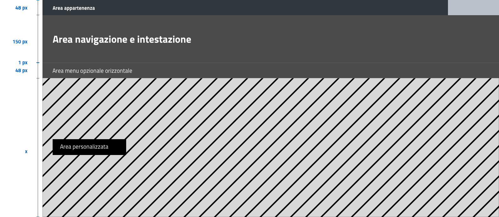

Componenti
----------

Bottoni
~~~~~~~

Di seguito un esempio dello stile da utilizzare per i bottoni.

I colori sono personalizzabili in base alla palette che sarà stata
individuata per ciascun sito web. È possibile impostare le dimensioni
dei bottoni utilizzando le `classi di utilità
responsive <https://italia.github.io/design-web-toolkit/components/detail/text--size.html>`__
(``u-text-r-*``).

.. raw:: html

   <iframe class="lg-example" src="https://italia.github.io/design-web-toolkit/components/preview/button--default.html"></iframe>
   <p class="wy-text-right"><a class="reference external" href="https://italia.github.io/design-web-toolkit/components/detail/button--default.html">mostra il codice</a></p>

.. raw:: html

   <iframe class="lg-example" src="https://italia.github.io/design-web-toolkit/components/preview/button--info.html"></iframe>
   <p class="wy-text-right"><a class="reference external" href="https://italia.github.io/design-web-toolkit/components/detail/button--info.html">mostra il codice</a></p>

.. raw:: html

   <iframe class="lg-example" src="https://italia.github.io/design-web-toolkit/components/preview/button--danger.html"></iframe>
   <p class="wy-text-right"><a class="reference external" href="https://italia.github.io/design-web-toolkit/components/detail/button--danger.html">mostra il codice</a></p>

Form
~~~~

.. admonition:: SI DEVE

   Nei form ogni campo deve essere sempre associato, anche attraverso il tag ```<label>```,
   a un'etichetta che ne descriva in maniera chiara il contenuto che deve essere inserito.
   Per essere sempre leggibile, l’etichetta deve essere posizionata esternamente al campo. Deve essere
   consentito inoltre lo spostamento da un campo all’altro tramite il tasto Tab.

Esempio di stile per form
^^^^^^^^^^^^^^^^^^^^^^^^^

.. raw:: html

   <iframe class="lg-example" src="https://italia.github.io/design-web-toolkit/components/preview/formtpl--example.html"></iframe>
   <p class="wy-text-right"><a class="reference external" href="https://italia.github.io/design-web-toolkit/components/detail/formtpl--example.html">mostra il codice</a></p>

Form errore
^^^^^^^^^^^

.. admonition:: SI DEVE

   In caso di errori o di mancata compilazione dei campi di un form si dovrà sempre evidenziare in maniera immediatamente percepibile quale sia il campo, o i campi, che non soddisfano le richieste, aggiungendo l’indicazione dell’azione da compiere per il corretto completamento.

.. raw:: html

   <iframe class="lg-example" src="https://italia.github.io/design-web-toolkit/components/preview/formtpl--errors.html"></iframe>
   <p class="wy-text-right"><a class="reference external" href="https://italia.github.io/design-web-toolkit/components/detail/formtpl--errors.html">mostra il codice</a></p>

Alert
^^^^^

Per i messaggi di "allerta" contestuali alla compilazione (messaggi di
errore o di successo) è importante **evitare di veicolare l'informazione
unicamente tramite l'utilizzo del colore**: l'esito dell'operazione va
chiarito in maniera evidente nel testo e, possibilmente, tramite
un'icona esplicativa.

Alert per errori
^^^^^^^^^^^^^^^^

.. raw:: html

   <iframe class="lg-example" src="https://italia.github.io/design-web-toolkit/components/preview/alert--error.html"></iframe>
   <p class="wy-text-right"><a class="reference external" href="https://italia.github.io/design-web-toolkit/components/detail/alert--error.html">mostra il codice</a></p>

Alert per messaggi di attenzione
''''''''''''''''''''''''''''''''

.. raw:: html

   <iframe class="lg-example" src="https://italia.github.io/design-web-toolkit/components/preview/alert--warning.html"></iframe>
   <p class="wy-text-right"><a class="reference external" href="https://italia.github.io/design-web-toolkit/components/detail/alert--warning.html">mostra il codice</a></p>

Alert per messaggi di successo
''''''''''''''''''''''''''''''

.. raw:: html

   <iframe class="lg-example" src="https://italia.github.io/design-web-toolkit/components/preview/alert--success.html"></iframe>
   <p class="wy-text-right"><a class="reference external" href="https://italia.github.io/design-web-toolkit/components/detail/alert--success.html">mostra il codice</a></p>

Alert per informazioni
''''''''''''''''''''''

.. raw:: html

   <iframe class="lg-example" src="https://italia.github.io/design-web-toolkit/components/preview/alert--info.html"></iframe>
   <p class="wy-text-right"><a class="reference external" href="https://italia.github.io/design-web-toolkit/components/detail/alert--info.html">mostra il codice</a></p>

Carousel
~~~~~~~~

.. admonition:: SI DOVREBBE

   Evitare l’utilizzo di carousel (slider) automatici.

I dati statistici raccolti riguardo l’interazione degli utenti con i
carousel ne rivelano un utilizzo effettivo marginale (1%).

Lo **scorrimento automatico dei contenuti è generalmente sconsigliato**
poiché, di fatto, riduce la visibilità delle informazioni. Inoltre può
esser difficoltoso leggere l’intero contenuto di una slide prima che
venga sostituita automaticamente dalla successiva. Infine introduce
problemi di accessibilità per chi utilizza una tastiera o uno screen
reader.

Nel caso si configuri l'assoluta necessità di utilizzare un carousel:

-  i titoli dei contenuti devono essere visibili in ogni momento (fuori
   dalle slide quindi)
-  l’utente deve poter controllare lo scorrimento (stop / avvio)
-  i controlli devono poter esser utilizzabili anche tramite tastiera
   (oltre che con mouse / touch)

Nella maggior parte dei casi risulta più conveniente sostituire il
carousel con una presentazione statica dei contenuti (ad esempio, una
galleria di immagini) in modo che siano tutti visibili immediatamente o
tramite scorrimento manuale non automatico.

Header
~~~~~~

Le indicazioni presenti in questa sezione sono rivolte a tutte le
pubbliche amministrazioni (centrali e locali) e gli enti e le società a
loro afferenti (ad esempio società partecipate, consorzi, comunità);
vanno applicate nella progettazione dei siti istituzionali e tematici.

Contenuti
^^^^^^^^^

.. admonition:: SI DEVE

   La testata deve contenere le seguenti funzionalità:

   - denominazione dell'amministrazione / ente / società / sito tematico (link **in formato testuale** che punta alla home page)
   - barra di accesso al livello gerarchico superiore dell'amministrazione (o all'amministrazione afferente nel caso di un sito tematico)
   - stemma / logo dell'amministrazione / ente / società / sito tematico
   - accesso al menu di navigazione

.. admonition:: SI PUÒ

   La testata può inoltre contenere una o più delle seguenti funzionalità:

   - campo di ricerca
   - accesso diretto ai servizi (al form di login)
   - link ai social network
   - selezione lingue

Componenti
^^^^^^^^^^

La struttura della testata è suddivisa in 3 aree funzionali.



   Struttura header

1. Area appartenenza
''''''''''''''''''''

Contiene l'indicazione dell'amministrazione di appartenenza e, se
necessario, l'accesso ai servizi. Il colore consigliato
per la barra superiore è #303030.

Testo: bold-600 (16px su desktop) in colore bianco.

2. Area navigazione e intestazione
''''''''''''''''''''''''''''''''''

Contiene l'accesso al menu di navigazione, lo stemma e la denominazione
**in formato testuale** dell'amministrazione / ente; eventualmente: il
campo di ricerca e le selezioni dei social network e delle lingue.
L'area di navigazione può essere estesa dalla presenza del menu
orizzontale.

Testo del titolo: bold-700 (32px su desktop).

.. admonition:: SI PUÒ

   Il colore di fondo dell'area navigazione e intestazione è personalizzabile
   (tenendo presente i `requisiti di accessibilità <../service-design/accessibilita.html>`__
   nell'utilizzo dei `colori <../user-interface/stile.html#colori>`__).


.. admonition:: SI DEVE

   L'icona burger, se presente nella versione desktop, deve essere accompagnata dall'etichetta "MENU".

.. figure:: images/burger-menu.png
   :alt: icona burger

   Icona burger

.. admonition:: SI DOVREBBE

   Lo stemma dovrebbe, preferibilmente, essere utilizzato nella versione al tratto, se presentato su sfondo diverso dal bianco.

.. figure:: images/stemma.png
   :alt: esempio di logo

   Esempio di logo

.. admonition:: SI DEVE

   Le etichette per la selezione delle lingue seguono la definizione
   `ISO-639-2 <https://en.wikipedia.org/wiki/List_of_ISO_639-2_codes>`__ (3 lettere).

.. admonition:: SI DEVE

   Le icone per l'accesso alle pagine social sono posizionate a destra della testata, sopra il campo di ricerca.
   Quando il numero delle icone social supera le 3 è possibile aggiungere un'icona generica che dà accesso alle restanti.

3. Area personalizzata
''''''''''''''''''''''

Lo spazio a disposizione per la personalizzazione è a discrezione
dell'amministrazione.

.. admonition:: SI DOVREBBE

   Per garantire una rapporto equilibrato fra le diverse aree funzionali della testata si consiglia di utilizzare
   per l'Area personalizzata altezze multiple dell'Area di appartenenza (di circa 3, 5 o 7 volte).

Esempio di header
'''''''''''''''''

L'allineamento dei componenti della testata è basato su una griglia a 12
colonne e sui conseguenti adattamenti nelle versioni responsive secondo
quanto specificato nella `sezione griglie <layout.html#griglie>`__.

`visualizza l'header a tutte le risoluzioni
<https://italia.github.io/design-web-toolkit/components/detail/header--menu.html>`__

.. raw:: html

  <iframe class="lg-example" src="https://italia.github.io/design-web-toolkit/components/preview/header--menu.html"></iframe>
  <p class="wy-text-right"><a class="reference external" href="https://italia.github.io/design-web-toolkit/components/detail/header--menu.html">mostra il codice</a></p>


Footer
~~~~~~

Componenti
^^^^^^^^^^

La struttura del footer è suddivisa in 2 aree funzionali.

.. figure:: images/footer-struttura.png
   :alt: struttura footer


   Struttura footer

1. Barra di feedback
''''''''''''''''''''

Contiene l'accesso a un form tramite il quale gli utenti possono inviare
un feedback all'amministrazione.

2. Contenuto
''''''''''''

L'area contiene

-  lo stemma e l'intestazione dell'amministrazione
-  i contatti
-  i social (tutti)
-  la sezione "Amministrazione trasparente"
-  link a privacy policy e note legali
-  i crediti

Colori
^^^^^^

Indipendentemente dalla tipologia di sito si consiglia di adottare le seguenti
indicazioni per i colori del footer:

.. raw:: html

   <div class="palette-example"><p><span class="lg-color-example" style="background:#30373d"></span>Colore di sfondo #30373d</p></div>
   <div class="palette-example"><p><span class="lg-color-example" style="background:#65dde0"></span>Colore dei link #65dde0</p></div>
   <div class="palette-example"><p><span class="lg-color-example" style="background:#c6cace"></span>Testo scuro #c6cace</p></div>
   <p></p>

Il testo normale e i titoli delle sezioni possono apparire in bianco (#ffffff).

Applicazioni
^^^^^^^^^^^^

Esempio desktop 1440
''''''''''''''''''''

.. figure:: images/esempio-desktop-1440.png
   :alt: esempio desktop 1440

   Esempio desktop 1440

Esempio mobile 320
''''''''''''''''''

.. figure:: images/esempio-mobile-320.png
   :alt: esempio mobile 320

   Esempio mobile 320
