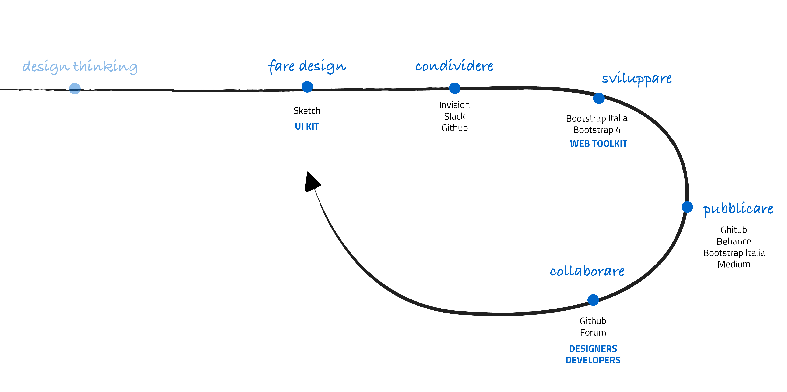
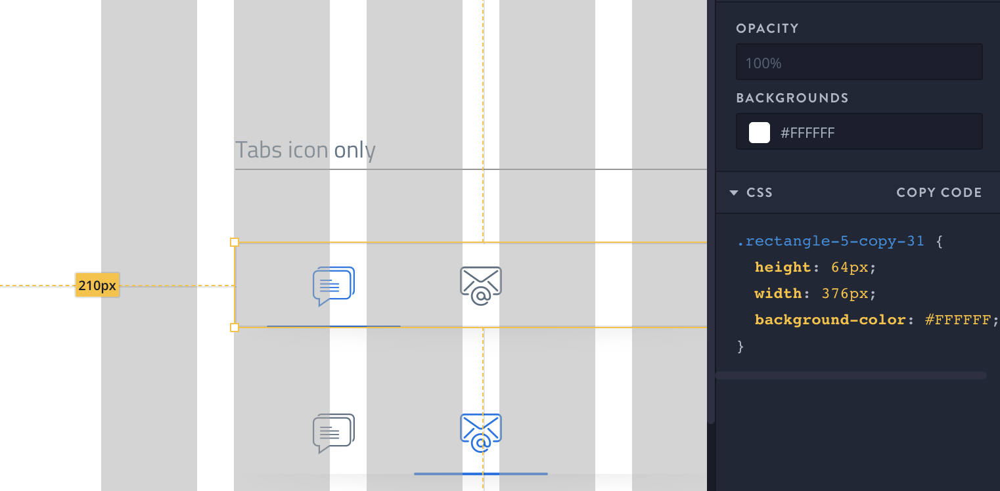

Dalla progettazione Hi-fi allo sviluppo
---------------------------------------

Fare design: lo UI-Kit
~~~~~~~~~~~~~~~~~~~~~~

Lo UI-Kit è un set di *web elements* come i bottoni, le tabs, lo stile
tipografico ed altro, che combinati insieme servono a costruire un prototipo
di interfaccia per un sito o per un’applicazione web.

Lo strumento utilizzato per creare lo UI-Kit è **Sketch**. La scelta è stata
dettata dalle peculiari caratteristiche del software che permette la gestione
dinamica dei *simboli* e la condivisione delle *librerie*. Inoltre, mettendo a
disposizione una piattaforma di sviluppo collaborativo, permette di installare
innumerevoli estensioni (*plugin*) a seconda delle esigenze di design.

Lo UI-kit è costituito da più file che vengono man mano implementati, ognuno di
essi contenente una categoria o macro categoria di elementi.

Come iniziare
^^^^^^^^^^^^^

Al seguente indirizzo sono disponibili le istruzioni su come scaricare e
utilizzare lo UI Kit:

* `design-ui-kit <https://github.com/italia/design-ui-kit>`_

Condividere
___________

Quanto realizzato nel design viene condiviso con gli sviluppatori attraverso lo
strumento di collaborazione **Invision**.
In particolare è possibile analizzare, attraverso la funzione *“inspect mode”*
gli aspetti di stile in codice CSS e gli asset statici da esportare e utilizzare
in fase di sviluppo.

Pubblicare
__________

Lo UI Kit è pubblicato su **Github**, uno strumento che permette di visionare
tutte le fasi di progettazione e sviluppo grazie al **version control system.**

Gli strumenti a disposizione sono:

* `Github Repository <https://github.com/italia/design-ui-kit>`_ , librerie di
  sketch e file .sketch scaricabili

* `UI KIT Github Project <https://github.com/italia/design-ui-kit/projects>`_,
  un elenco dei macro e microtask aggiornati settimanalmente

* `Google sheet Roadmap <https://docs.google.com/spreadsheets/d/183hI6EBJo3EeiEcQPGZIe3hNN7EerTU5Udk6SkrH2OU/edit#gid=0>`_,
  un elenco completo di tutti i componenti con l’indicazione di quelli realizzati
  e di quelli in programma

Come collaborare
________________

La continua evoluzione del progetto avviene attraverso il
confronto e la collaborazione non solo su tutto quanto è ancora
in fase di realizzazione ma anche su tutta la documentazione già pubblicata.

Per collaborare sia al design dei componenti che allo sviluppo, oppure per dare
un feedback a quanto già realizzato è possibile utilizzare le
**issues di GitHub**. Sono uno strumento molto simile alle email, consistono
in messaggio che viene condiviso e su cui si può discutere con il resto del
gruppo. Ogni repository ha la propria sezione dedicata alle Issues.

Per discussioni più ampie invece è disponibile un canale dedicato al Design e
nello specifico all'`User Interface <https://forum.italia.it/c/design/user-interface>`_
nel `Forum Italia.it  <https://forum.italia.it/>`_.
