Design
------

Stile
~~~~~

L’uso della *style guide* è utile ai fini di creare consistenza tra i vari layout di un sito web o di un’app, favorendo una migliore esperienza di navigazione dell’utente.
A questo scopo è necessario che tutti i componenti di un interfaccia siano rappresentati visivamente in modo coerente. Lo stile, pertanto, agendo su tutti i componenti dell’interfaccia, dà una caratterizzazione visiva al layout e quindi una riconoscibilità e una coerenza tra le varie interfacce di un sito web.

Tipografia
__________

Typefaces
^^^^^^^^^

Titillium Web
:::::::::::::

.. figure:: images/artboard.png
   :alt: artboard

La famiglia di font `Titillium Web <https://fonts.google.com/specimen/Titillium+Web>`_
, è stata realizzata come progetto didattico dagli studenti del corso in Type
Design dell’Accademia di Belle Arti di Urbino. Il Typeface è rilasciato con
licenza SIL Open Font License ed è scaricabile da Google Font, una piattaforma
di distribuzione gratuita di Web font.

Il Titillium Web *è una famiglia di font sans serif* composta da 11 stili.

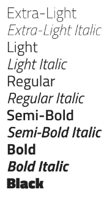

La *x-height* ampia e la struttura lineare fanno del Titillium un font che si
adatta bene ad essere utilizzato sul web.

Roboto Mono
:::::::::::

Il `Roboto Mono <https://fonts.google.com/specimen/Roboto+Mono>`_ è la variante
monospaced della famiglia Roboto ed anche in questo caso si tratta di un Web
Font scaricabile ed utilizzabile gratuitamente. È stato introdotto nelle linee
guida per la chiarezza e leggibilità dei numeri: è adatto ad essere utilizzato
per la rappresentazione di numeri, calcoli matematici, numeri in tabelle,
codice di programmazione.

Può essere utilizzato qualsiasi altro font purchè sia leggibile, e la scelta
sia motivata da forti caratteristiche identitarie.

Gerarchia
_________

La gerarchia visuale serve a gestire la trasmissione di un messaggio e il suo
impatto. Diversi elementi possono contribuire a creare una gerarchia, uno di
questi è l’uso della scala tipografica.

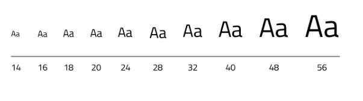

Titoli e sottotitoli
^^^^^^^^^^^^^^^^^^^^

Di seguito è riportata la formattazione del Font Titillium.

.. raw:: html

   
H1 Bold 40 px

   
H2 Bold 32 px

   
H3 Bold 28 px

   
H4 Bold 24 px

   
H5 Regular 20 px

   
H6 Semibold 16 px

Corpo del testo e didascalie
^^^^^^^^^^^^^^^^^^^^^^^^^^^^

Mobile
::::::

La dimensione del corpo del testo, utilizzando i caratteri tipografici del
Titillium non può essere inferiore a 16px. Si utilizzano le misure di 12px e
14px in caso di didascalie, note, o comunque etichette e testi secondari di
dimensioni ridotte.

.. raw:: html

   
Body Text 16 px

   
Caption semibold 14px

   
Caption regular 14px

Desktop
:::::::

Il corpo del testo su desktop ha una dimensione di 18px, sempre con riferimento
al *typeface* Titillium. Si considerano le misure small di 16px ed xsmall di
14px per le didascalie, le note a margine e i testi secondari.

.. raw:: html

   
Body text 18px

   
Caption small semibold 16px

   
Caption extra small 14px

Paragrafo
_________

Lunghezza
^^^^^^^^^

La lunghezza di paragrafo che permette una lettura confortevole del testo non
supera i 75 caratteri. In caso di colonne multiple la lunghezza è compresa tra
40 e 50 caratteri. Per i testi a margine la lunghezza è non inferiore ai 12-15
caratteri.

Allineamento
^^^^^^^^^^^^

Un paragrafo di testo deve essere composto con allineamento a sinistra. Nei
casi in cui si prevedono paragrafi a margine posti a sinistra del blocco di
testo principale, il paragrafo è allineato a destra. L’allineamento
giustificato e senza sillabazione è invece sempre da evitare per l’incongrua
spaziatura delle parole e la minore leggibilità che comporta.

Definizione
^^^^^^^^^^^

I paragrafi possono essere distinti o applicando uno spazio tra di essi o in
alternativa usando una indentatura di misura pari a quella del leading.

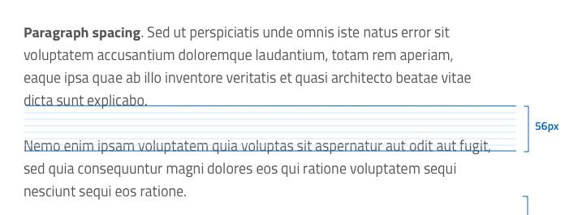

Interlinea
^^^^^^^^^^

L’interlinea o leading sia dei titoli che del corpo di testo è calcolata
tenendo conto anche della griglia orizzontale di 8px.

.. raw:: html

   
 Body text 16px

   
 Body text 18px 

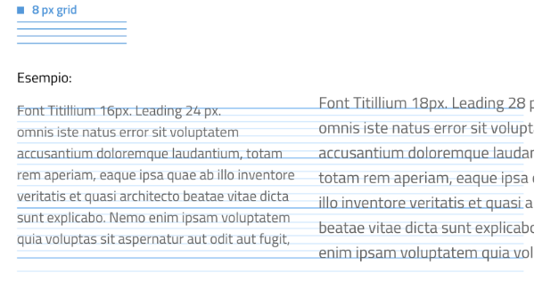

.. NOTE::
   Per informazioni più dettagliate sui paragrafi e la tipografia in generale vedi
   `UI KIT <https://github.com/italia/design-ui-kit>`_,
   `Web ToolKit <https://github.com/italia/design-web-toolkit>`_ e
   `Bootstrap Italia <https://github.com/italia/bootstrap-italia>`_.

Colore del testo
^^^^^^^^^^^^^^^^

Il colore del body text deve essere tale da garantire un rapporto di contrasto
minimo con lo sfondo sfondo di 4,5:1 (AA) come stabilito dalle specifiche di
accessibilità. Ad esempio un testo nero su fondo bianco avrà un valore HEX
compreso tra #000000 e #666666, oppure un ’opacità tra il 100% e 60%; un testo
blu come ad esempio #001A33 può essere utilizzato fino ad un massimo di 70%
di opacità.

Text Link
^^^^^^^^^

Il link deve avere un elemento di distinguibilità rispetto al testo normale.
Pertanto si usa la sottolineatura, specie se il link è inserito all’interno di
un paragrafo oppure si può utilizzare anche il bold.

.. NOTE::
   Legature e crenatura: La leggibilità del testo, nelle versioni dei browser più
   recenti, può essere migliorata con l’utilizzo della dichiarazione
   ``text-rendering: optimizeLegibility`` che attiva il controllo della crenatura del
   testo e la sostituzione automatica dei glifi delle legature. Utilizzando una
   font OpenType possono essere sfruttate opzioni per le legature comuni e
   discrezionali con la dichiarazione ``font-feature-settings``.

Colori
______

Si consiglia l’utilizzo di una palette costituita da non più di 5 colori e di
questi non più di 3 avranno un differente valore di Hue.

La palette può essere di tipo monocromatico o costituita da associazioni di colori
con differente Hue. 

La palette monocromatica è costituita dal **colore base** e
dalle sue variazioni in termini di saturazione e/o luminosità. 
   
.. figure:: images/esempio palette monocromatica.png
   :alt: esempio palette monocromatica
   
.. figure:: images/esempio palette monocromatica rosso.png
   :alt: esempio palette monocromatica con rosso

Gli schemi colore
non monocromatici, invece, oltre al colore base e alle sue variazioni, comprendono
un colore che può essere scelto tra gli analoghi, complementari, triadici, ecc.
del colore base, oppure scelto dalla gamma di colori appartenenti all’identità visiva.

In ogni palette sono presenti inoltre le **tinte neutre** (grigi, bianco e nero).

.. figure:: images/esempio palette analogo.png
   :alt: palette con colore analogo

Come costruire uno schema colore
^^^^^^^^^^^^^^^^^^^^^^^^^^^^^^^^

La scelta dei colori è dettata dal materiale identitario dell’Ente o Agenzia
(logo, stemma, gonfalone etc.) o comunque da elementi afferenti alla sua
riconoscibilità.

Il colore base è quello che viene utilizzato per una percentuale maggiore
rispetto agli altri colori, definiti secondari.

Tra i colori secondari ci sono sia quelli strettamente connessi al colore base,
sia un eventuale colore di risalto o accent color che viene utilizzato in
misura minore poiché è associato a elementi che presuppongono un’interazione:
bottoni, elementi di controllo (sliders, radio ecc) links, text fields.

.. figure:: images/esempio palette triadici.png
   :alt: esempio palette colore triadico

La palette può essere **estesa** ossia si possono creare variazioni in termini
di saturazione e luminosità dei colori scelti.

Palette estesa. Come creare le variazioni di un colore
::::::::::::::::::::::::::::::::::::::::::::::::::::::

Da un colore si possono generare tinte, ombre e toni.

Le **tinte** e le **ombre** consistono nell’aggiunta rispettivamente di bianco
e di nero al colore di base, che tradotto nel web design significa variare i
valori di saturazione (S) e luminosità (B). Per esempio, dato un colore base
con i valori H 93; S 100; B 50, è sufficiente sottrarre 10 gradi di luminosità
(B) per ottenere le variazioni più scure e  aggiungere 10 gradi di luminosità
(B) per quelle più chiare fino a un massimo di 80 gradi di luminosità.

Per ottenere le cosiddette “tinte” basta aumentare progressivamente di 4 gradi
la luminosità a partire da un valore di  80 e contemporaneamente diminuire
la saturazione (S) di 15 gradi.

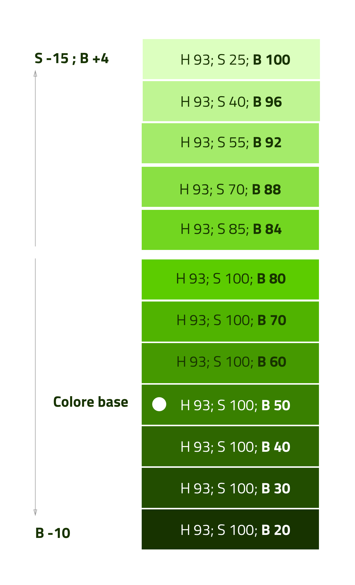

   Esempio di variazioni partendo dal colore base H 93, S 100; B 50 verso le tinte
   (alto) e verso le ombre (basso)

Per ottenere i **toni** è necessario diminuire contemporaneamente i valori di
saturazione e luminosità di 10 gradi.

La palette delle amministrazioni centrali
^^^^^^^^^^^^^^^^^^^^^^^^^^^^^^^^^^^^^^^^^

Un esempio di schema cromatico costruito sui principi appena descritti è la palette basata sul colore base Blu Italia (#0066cc)

Pensata per un design semplice e minimalista è una palette costituita dalle
variazione del colore base, più le tinte neutre. Sono presenti anche colori che
possiamo definire *utility colors* ossia da utilizzare per i messaggi di
feedback (warning, success, error) o per la realizzazione di grafiche.

La palette dello UI Kit è piuttosto estesa: comprende molte variazioni in
tinte, toni e ombre del colore base (blu italia) e dei colori secondari e
neutri, permettendo così una certa flessibilità di uso.

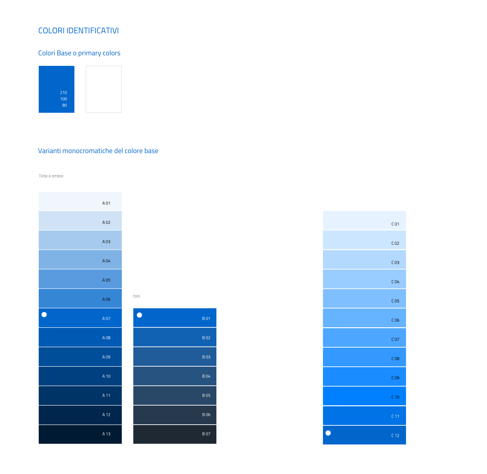

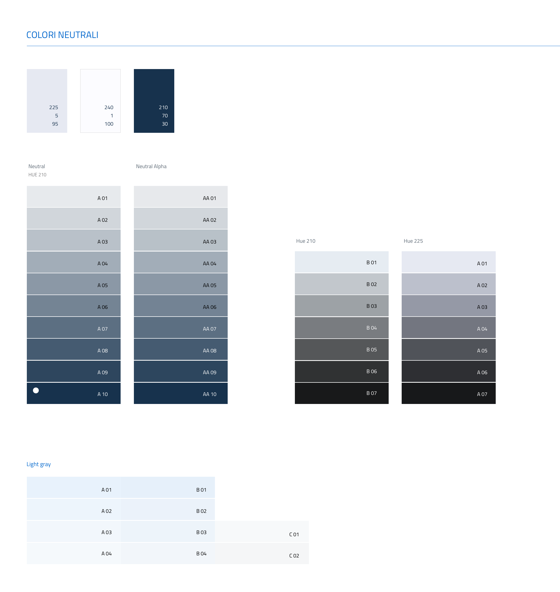

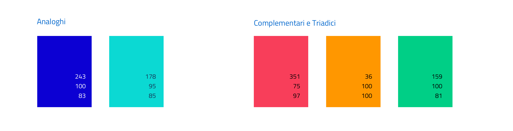

Griglie
~~~~~~~

All’interno dello spazio a disposizione l’organizzazione del contenuto deve
essere strutturata seguendo un sistema di **griglie responsive** per mantenere
una efficace esperienza utente trasversalmente ai dispositivi utilizzati.

La griglia rappresenta la struttura invisibile che permette di organizzare i
contenuti della pagina. Una griglia di impaginazione consiste in **colonne**
di testo (e/o immagini) separate da spazi intercolonna e contornate dai margini
della pagina.

Le dimensioni delle colonne vanno adattate ai cambiamenti della viewport: ogni
colonna occuperà una percentuale di spazio specifica a seconda che sia
visualizzata su dispositivi desktop, tablet, o smartphone. La ridisposizione
dei contenuti,a seconda delle dimensione dello schermo, garantisce che i testi
siano leggibili anche sugli schermi più piccoli e l’interazione utente (es.
form, controlli dinamici) rimanga agevole.

Impostazioni della griglia di costruzione consigliata
_____________________________________________________

+-----------------------------+-------------+--------+--------+------------+
| Risoluzione                 | Small       | Medium | Large  | Extralarge |
+-----------------------------+-------------+--------+--------+------------+
| Breakpoint                  | <768px      | ≥768px | ≥992px | ≥1280px    |
+-----------------------------+-------------+--------+--------+------------+
| Larghezza max del container | None (auto) | 688px  | 904px  | 1184px     |
+-----------------------------+-------------+--------+--------+------------+
| Gutter                      | 12          | 20     | 20     | 28         |
+-----------------------------+-------------+--------+--------+------------+

La griglia orizzontale di 8 px
______________________________

La griglia orizzontale contribuisce alla consistenza del design e a determinare
il pattern di lettura di un sito web. In un sistema condiviso come quello di
uno UI kit, è necessario avere una metrica comune, per mantenere coerenza anche
tra diversi siti web appartenenti a enti o pubbliche amministrazioni diverse.

La griglia orizzontale è definita sulla baseline del testo, ossia la linea
dove poggiano le lettere del font scelto.
La baseline diventa una griglia a cui ancorare non solo il testo ma anche gli
oggetti del layout. La baseline è di 8px ed è basata sul Titillium a 16px.
Avendo come base la misura di 8 px e i suoi multipli per calcolare dimensioni,
padding e margini dei vari elementi, si può ottenere un ritmo verticale
armonico.

Per maggiori informazioni sulla griglia:

* `Le griglie: alla scoperta dello Ui Kit di designers <https://medium.com/designers-italia/le-griglie-alla-scoperta-dello-ui-kit-di-designers-italia-partendo-dalle-basi-d7943cbdccc9>`_.

Componenti
~~~~~~~~~~

Bottoni
_______

Di seguito un esempio dello stile da utilizzare per i bottoni.

I colori sono personalizzabili in base alla palette che sarà stata individuata
per ciascun sito web. È possibile impostare le dimensioni dei bottoni
utilizzando le
`classi di utilità responsive <https://italia.github.io/design-web-toolkit/components/detail/text--size.html>`_
(u-text-r-\*).

`Default button: Mostra il codice <https://italia.github.io/design-web-toolkit/components/detail/button--default.html>`_

`Info button: Mostra il codice <https://italia.github.io/design-web-toolkit/components/detail/button--info.html>`_

`Danger button: Mostra il codice <https://italia.github.io/design-web-toolkit/components/detail/button--danger.html>`_

Input Field
___________

Negli input field ogni campo deve essere sempre associato, anche attraverso il
tag ``<label>``, a un’etichetta che ne descriva in maniera chiara il contenuto
che deve essere inserito. Deve essere consentito inoltre lo spostamento da un
campo all’altro tramite il tasto Tab.

`Esempio di stile per form <https://italia.github.io/design-web-toolkit/components/detail/formtpl--example.html>`_

Form errore
^^^^^^^^^^^

In caso di errori o di mancata compilazione dei campi di un form si dovrà sempre
evidenziare in maniera immediatamente percepibile quale sia il campo, o i campi,
che non soddisfano le richieste, aggiungendo l’indicazione dell’azione da
compiere per il corretto completamento.

`Esempio di form errore <https://italia.github.io/design-web-toolkit/components/detail/formtpl--errors.html>`_

Alert
^^^^^

Per i messaggi di “allerta” contestuali alla compilazione (messaggi di errore
o di successo) è importante **evitare di veicolare l’informazione unicamente tramite l’utilizzo del colore**:
l’esito dell’operazione va chiarito in maniera evidente nel testo e,
possibilmente, tramite un’icona esplicativa.

`Alert per errori <https://italia.github.io/design-web-toolkit/components/detail/alert--error.html>`_

`Alert per messaggi di attenzione <https://italia.github.io/design-web-toolkit/components/detail/alert--warning.html>`_

`Alert per messaggi di successo <https://italia.github.io/design-web-toolkit/components/detail/alert--success.html>`_

`Alert per informazioni <https://italia.github.io/design-web-toolkit/components/detail/alert--info.html>`_

Carousel
________

**Lo scorrimento automatico dei contenuti è generalmente sconsigliato** poiché,
di fatto, riduce la visibilità delle informazioni. Inoltre può essere
difficoltoso leggere l’intero contenuto di una slide prima che venga
sostituita automaticamente dalla successiva. Infine introduce problemi di
accessibilità per chi utilizza una tastiera o uno screen reader.

Infatti, i dati statistici raccolti riguardo l’interazione degli utenti con i
carousel ne rivelano un utilizzo effettivo marginale (1%).

Nel caso si configuri l’assoluta necessità di utilizzare un carousel:

* i titoli dei contenuti devono essere visibili in ogni momento (fuori dalle
  slide quindi);
* l’utente deve poter controllare lo scorrimento (stop / avvio);
* i controlli devono poter essere utilizzabili anche tramite tastiera (oltre
  che con mouse / touch).

Nella maggior parte dei casi risulta più conveniente sostituire il carousel con
una presentazione statica dei contenuti (per esempio una galleria di immagini),
in modo che siano tutti visibili immediatamente o tramite scorrimento manuale
non automatico.

Data display: tabelle
_____________________

In genere nelle tabelle un corretto allineamento del testo e una giusta
spaziatura fra le colonne e le righe sono già in grado di creare la percezione
delle strutture verticali e orizzontali che sottostanno al contenuto, rendendo
superflua la presenza di molte delle linee divisorie o dei fondini di cella.

Una tabella leggera (meno linee, meno colori) permette di concentrarsi meglio
sul contenuto.

Header
______

Le indicazioni presenti in questa sezione sono rivolte a tutte le pubbliche
amministrazioni (centrali e locali) e gli enti e le società a loro afferenti
(ad esempio società partecipate, consorzi, comunità); vanno applicate nella
progettazione dei siti istituzionali e tematici.

La testata deve contenere le seguenti funzionalità:

* denominazione dell’amministrazione / ente / società / sito tematico (link in
  formato testuale che punta alla home page)
* barra di accesso al livello gerarchico superiore dell’amministrazione (o
  all’amministrazione afferente nel caso di un sito tematico)
* stemma / logo dell’amministrazione / ente / società / sito tematico accesso
  al menu di navigazione

La testata può inoltre contenere una o più delle seguenti funzionalità:

* campo di ricerca
* sign up/sign in
* link ai social network
* selezione lingue

La struttura della testata è suddivisa in 2 aree funzionali.

Area navigazione e intestazione
^^^^^^^^^^^^^^^^^^^^^^^^^^^^^^^

L’area di navigazione e intestazione contiene:

* l’accesso al menu di navigazione. L’icona burger, se presente nella versione
  desktop, deve essere accompagnata dall’etichetta “MENU”

  .. figure:: images/burger-menu.png
     :alt: burger menu

* lo stemma e la denominazione dell’amministrazione/ente in **formato testuale**.
  Lo stemma dovrebbe, preferibilmente, essere utilizzato nella versione al tratto,
  se presentato su sfondo diverso dal bianco

  .. figure:: images/stemma.png
     :alt: stemma

* il campo di ricerca
* le selezioni dei social network. Le icone per l’accesso alle pagine social
  sono posizionate a destra della testata, sopra il campo di ricerca. Quando il
  numero delle icone social supera le 3 è possibile aggiungere un’icona
  generica che dà accesso alle restanti
* la selezione della lingua. Le etichette seguono la definizione
  `ISO-639-2 <https://en.wikipedia.org/wiki/List_of_ISO_639-2_codes>`_ (3
  lettere)

L’area di navigazione può essere estesa dalla presenza del menu orizzontale.

Il colore di fondo dell’area navigazione e intestazione è personalizzabile
(tenendo presente i `requisiti di accessibilità <https://design-italia.readthedocs.io/it/stable/doc/service-design/accessibilita.html>`_
nell’utilizzo dei `colori <https://design-italia.readthedocs.io/it/stable/doc/user-interface/stile.html#colori>`_).

Area personalizzata
^^^^^^^^^^^^^^^^^^^

Lo spazio a disposizione per la personalizzazione è a discrezione dell’amministrazione.

Per garantire una rapporto equilibrato fra le diverse aree funzionali della
testata si consiglia di utilizzare per l’Area personalizzata altezze multiple
dell’Area di appartenenza (di circa 3, 5 o 7 volte).

Footer
______

La struttura del footer è suddivisa in 2 aree funzionali.

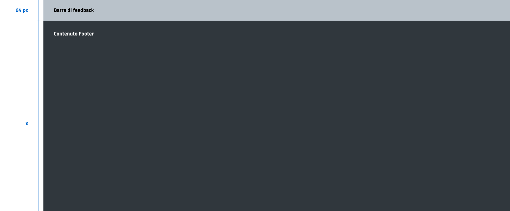

   Struttura footer

Barra di feedback
^^^^^^^^^^^^^^^^^

Contiene l’accesso a un form tramite il quale gli utenti possono inviare un
feedback all’amministrazione.

Contenuto
^^^^^^^^^

L’area contiene:

* lo stemma e l’intestazione dell’amministrazione
* i contatti
* i social (tutti)
* la sezione “Amministrazione trasparente”
* link a privacy policy e note legali
* i crediti

**Esempio desktop 1440**

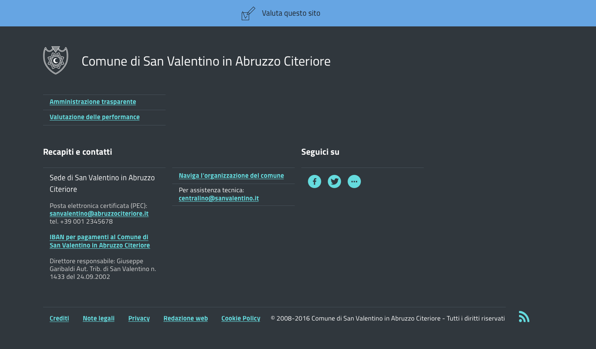

**Esempio mobile 320**

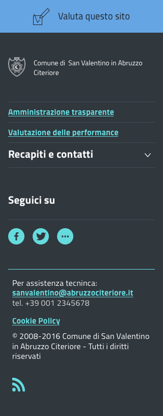

Pattern
~~~~~~~

Layout
______

L’impaginazione dei contenuti tramite un layout lineare (una o due colonne)
favorisce la **rapida scansione delle informazioni** e ne agevola la
consultazione soprattutto su touch screen, dove il pattern di interazione più
funzionale è lo scorrimento verticale della pagina.

Casi d’uso validi per l’utilizzo di una **colonna laterale** (``<nav>``, ``<aside>``)
sono quelli dove sussiste una immediata correlazione semantica con il contenuto
principale:

* menu contestuale della sezione del sito correntemente visualizzata;
* elenco di sezioni / contenuti / documenti correlati.

L’utilizzo di card favorisce la consultazione dei contenuti sugli schermi più
piccoli. Per esempio: elenchi di contenuti omogenei (anteprime di notizie o
eventi) possono essere presentati tramite card o liste posizionate in una
griglia responsive.

Più in generale, laddove i dati non hanno una struttura prevalentemente
tabulare, è consigliato l’utilizzo di card o liste al posto che di elementi
``<table>`` che risultano più difficili da rendere fruibili in maniera efficace
sui dispositivi mobili.

.. NOTE::
   Per una corretta definizione della struttura gerarchica dei contenuti, la
   suddivisione in parti deve essere espressa attraverso l’uso di markup semantico
   disponibile in HTML5, quali `<article>`,`<aside>`, `<figcaption>`, `<header>`,
   `<footer>`, ecc al posto del generico divisore `
`.

Iconografia
~~~~~~~~~~~

Quando si utilizzano delle icone è necessario assicurare una chiara
comprensione del loro significato. Pertanto ogni icona dovrà essere associata a
un tooltip che ne chiarisca l’azione. La stessa icona non deve essere
utilizzata per indicare azioni diverse all’interno della stesso sito.

Al fine di garantire una coerenza visiva si consiglia di utilizzare icone
provenienti da un unico set grafico come, per esempio, quelle disponibili
gratuitamente su `Font Awesome <https://fontawesome.com/>`_ o il set di icone
incluso nel web toolkit delle Linee Guida al quale è possibile contribuire
proponendo integrazioni o modifiche
