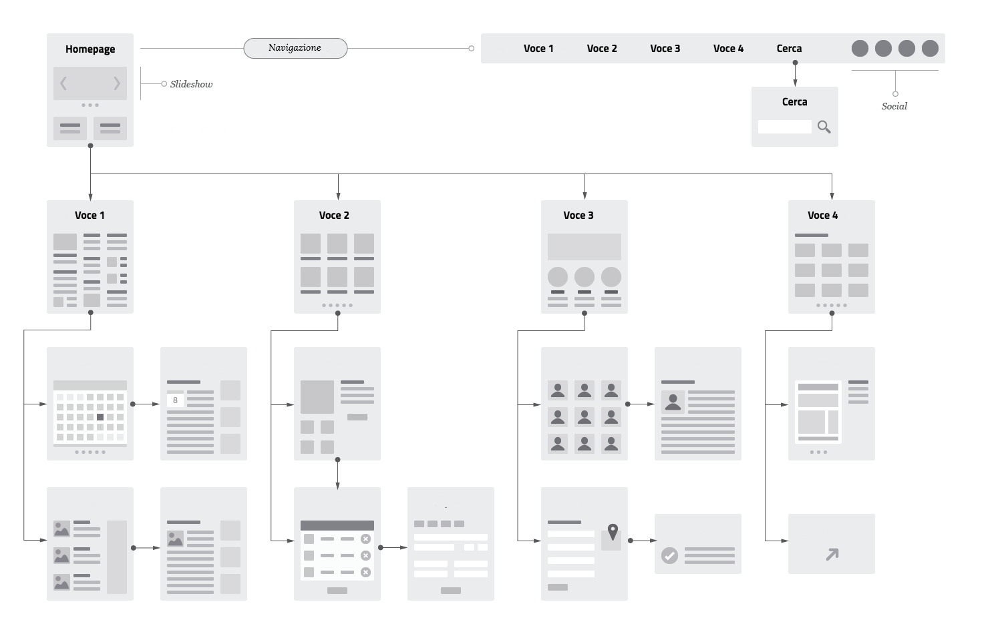
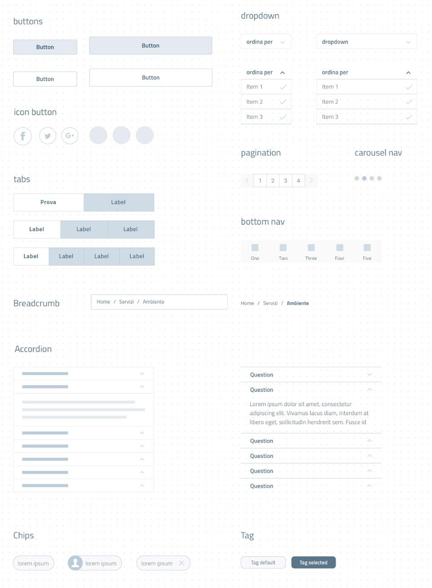
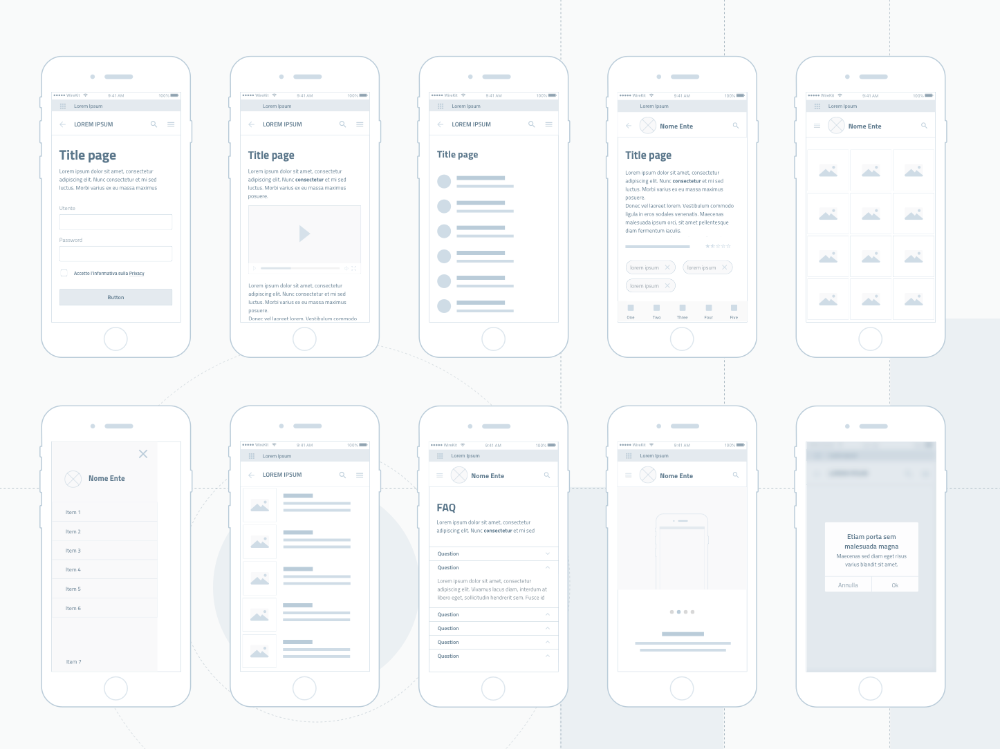
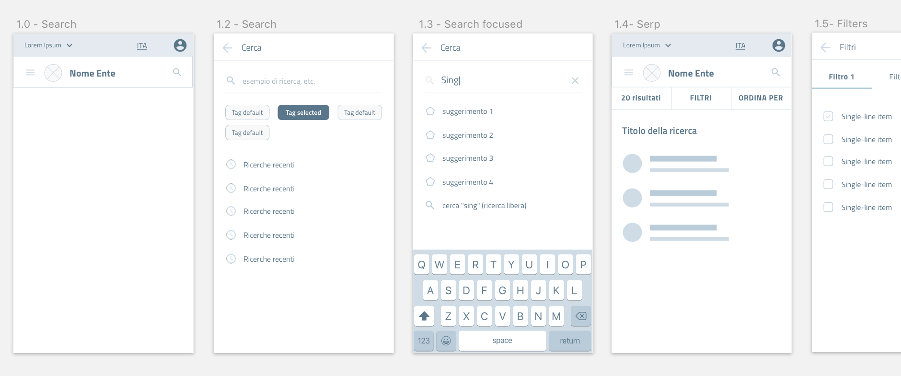
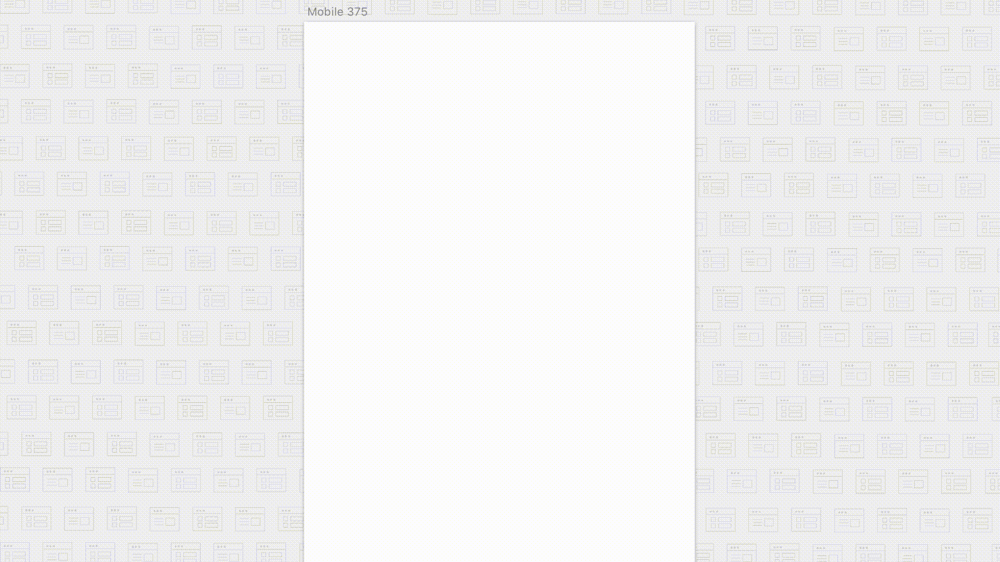

Il modello di un’interfaccia e il Wireframe Kit
-----------------------------------------------

Il livello di dettaglio più basso viene definito attraverso la creazione di un
modello (chiamato anche prototipo o, in inglese "wireframe") dell’interfaccia
utente, definendo una struttura di massima dell’esperienza utente durante il
suo percorso nella ricerca ed utilizzo del servizio.

La realizzazione di un prototipo “a bassa fedeltà” (in inglese, *lo-fi*) per
un’interfaccia utente definisce:

* l’organizzazione degli elementi interattivi nello spazio disponibile sullo
  schermo;

* la collocazione dei blocchi di contenuto;

* la sequenza di passaggi (*workflow*) che l’utente deve fare per concludere un
  processo;

* le modalità di interazione o comportamento, ossia come l’utente interagisce
  con il prodotto.

Tutto questo viene impaginato senza tenere in conto alcun dettaglio “estetico”:
durante questa fase infatti viene concretizzata soltanto la struttura portante
del servizio e le soluzioni ipotizzate in fase di ricerca.

Questa scelta assicura che l’attenzione sia incentrata sugli aspetti
fondamentali della navigazione e della struttura, nel pieno rispetto dei
requisiti di progetto e dei bisogni dei cittadini da soddisfare. In questo modo
si incoraggia la discussione e il confronto sulle soluzioni proposte.

    Figura 1 - Un esempio di "wireframe", o prototipo a "bassa fedeltà".

Nella Figura 1 è mostrato un esempio di prototipo costruito con un programma di
design, ma per costruire un wireframe si possono usare diversi metodi, dalla
carta ai numerosi software messi a disposizione dal mercato specificatamente per
questo scopo.

Il kit per la modellazione: il Wireframe Kit
~~~~~~~~~~~~~~~~~~~~~~~~~~~~~~~~~~~~~~~~~~~~

Il prototipo a bassa fedeltà può essere modellato utilizzando il **Wireframe
Kit** messo a disposizione da Designers Italia che può agire in diversi ambiti
nella fase di design.

Si possono trovare i file sorgente del Wireframe Kit in formato *Sketch* sul
repository GitHub dedicato:

- `Vedi i file sorgente del Wireframe Kit <https://https://github.com/italia/design-wireframe-kit>`_

Esso contiene una libreria di componenti come bottoni, campi di input, blocchi
di testo, ecc.

    Figura 2 - Un esempio dei componenti presenti nel Wireframe Kit.

Definisce inoltre dei *pattern*, ossia proposte di strutture di pagine tra le
più comuni nei siti delle pubbliche amministrazioni, e proposte di flussi, come
moduli per la ricerca di informazioni e menu di navigazione.

    Figura 3 - Un esempio dei pattern applicati nel Wireframe Kit.

Concretizza e applica processi di interazione che sono il risultato di una fase
di studio e ricerca (come descritto in dettaglio nella sezione
:doc:`Service Design </doc/service-design>`).

    Figura 4 - Un esempio di schermate sequenziali con pattern di ricerca.

Come si usa il kit
__________________

Per creare l’architettura di un sito o di un’app utilizzando il Wireframe Kit,
sarà quindi sufficiente scegliere e assemblare i componenti e i pattern di cui
il kit è composto.

    Figura 5 - Un esempio di composizione dei componenti del Wireframe Kit.

Può essere aggiunta anche l’interazione per testare i workflows e i
comportamenti desiderati. Il software scelto per costruire il Wireframe Kit è
`Sketch <https://www.sketchapp.com/>`_, uno strumento che permette la gestione
dinamica dei simboli e la condivisione della libreria in modo trasversale a
tutti i file su cui si intende lavorare. Sketch permette di cambiare le
caratteristiche dei singoli elementi e personalizzarli in modo rapido e
intuitivo.

Alternativamente, è possibile importare il file Sketch in altri programmi di
prototipazione, come `Adobe XD <https://www.adobe.com/it/products/xd.html>`_,
`Studio <https://studio.design/>`_, o `Figma <https://www.figma.com/>`_.

Indipendentemente da quale strumento si decida di utilizzare, la fase di
prototipazione *lo-fi* è estremamente importante sia in termini di efficacia,
ai fini della realizzazione di un prodotto utile ed intuitivo, sia in termini
di efficienza, perché revisionare un wireframe implica un effort minore rispetto
a modificare continuamente un prototipo ad "alta definizione".

Gli strumenti
_____________

Il Wireframe Kit è pubblicato su Github, una piattaforma che permette di
visionare tutte le fasi di progettazione e sviluppo grazie al controllo di
versione.

- Vedi i `file sorgente del Wireframe Kit <https://https://github.com/italia/design-wireframe-kit>`_

Per vedere il kit, i singoli componenti e i pattern, è sufficiente collegarsi
alla piattaforma di InVision:

- Vedi il `Wireframe Kit su InVision <https://invis.io/MJKVG83A8EZ>`_