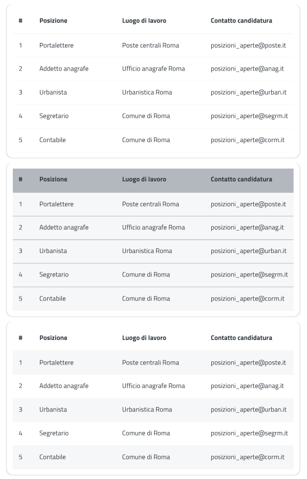
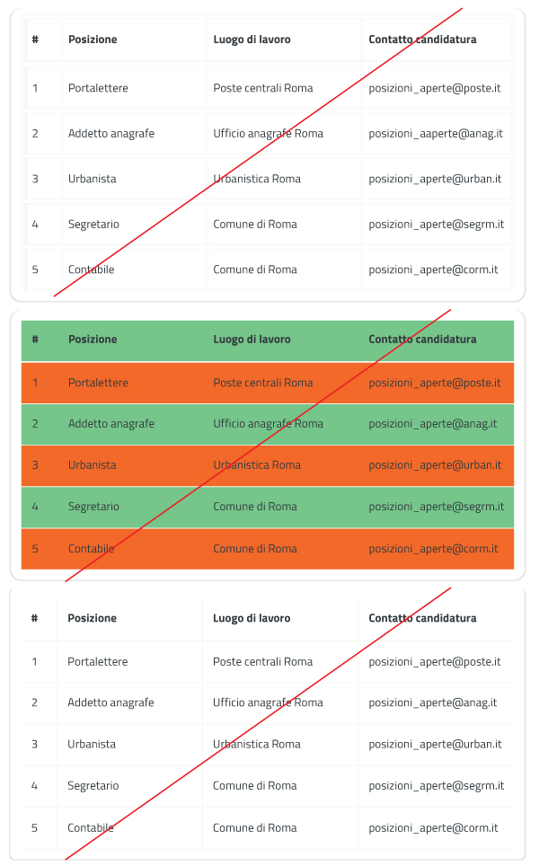
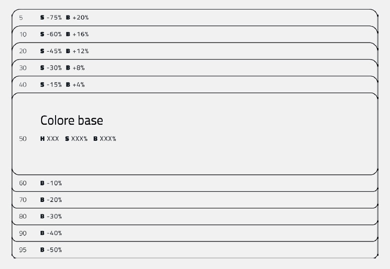
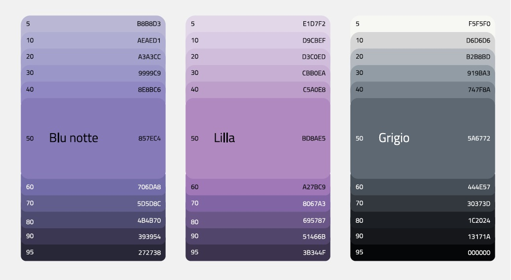

Stile
-----

Tipografia
~~~~~~~~~~

Web font
^^^^^^^^

Le Web font sono famiglie di caratteri tipografici la cui licenza d’uso
permette il download remoto per la loro visualizzazione in pagine web.
Introdotte dalla versione CSS2 con la dichiarazione ``@font-face``, le
Web font sono oggi pienamente compatibili con la maggioranza dei browser
(IE4+, Firefox 3.5+, Safari 3.1+, Opera 10+, Chrome 4.0+) e
costituiscono la soluzione più efficace per una coerente composizione
tipografica. Google Fonts è una piattaforma di distribuzione gratuita di
Web font.

Titillium Web
^^^^^^^^^^^^^

Il carattere tipografico istituzionale è la famiglia di font `Titillium
Web <https://www.google.com/fonts/specimen/Titillium+Web>`__, realizzato
come progetto didattico all’interno all’Accademia di Belle Arti di
Urbino e distribuito con licenza Open Font da Google Fonts. La famiglia
di caratteri Titillium Web è composta da numerose font di diversi pesi
tipografici (dall’Extra-Light all’Ultra-Bold) garantendo così un’estrema
flessibilità di utilizzo nelle composizioni dei testi.

Specimen della famiglia Titillium Web
'''''''''''''''''''''''''''''''''''''

.. raw:: html

   

   
Ecco un bianco scenario per tratteggiarvi l'accompagnamento degli oggetti di sfondo
      <small>extra light</small>
   

   
Ecco un bianco scenario per tratteggiarvi l'accompagnamento degli oggetti di sfondo
      <small>extra light italic</small>
   

   
Ecco un bianco scenario per tratteggiarvi l'accompagnamento degli oggetti di sfondo
      <small>light</small>
   

   
Ecco un bianco scenario per tratteggiarvi l'accompagnamento degli oggetti di sfondo
      <small>light italic</small>
   

   
Ecco un bianco scenario per tratteggiarvi l'accompagnamento degli oggetti di sfondo
      <small>normal</small>
   

   
Ecco un bianco scenario per tratteggiarvi l'accompagnamento degli oggetti di sfondo
      <small>normal italic</small>
   

   
Ecco un bianco scenario per tratteggiarvi l'accompagnamento degli oggetti di sfondo
      <small>semi bold</small>
   

   
Ecco un bianco scenario per tratteggiarvi l'accompagnamento degli oggetti di sfondo
      <small>semi bold italic</small>
   

   
Ecco un bianco scenario per tratteggiarvi l'accompagnamento degli oggetti di sfondo
      <small>bold</small>
   

   
Ecco un bianco scenario per tratteggiarvi l'accompagnamento degli oggetti di sfondo
      <small>bold italic</small>
   

   
Ecco un bianco scenario per tratteggiarvi l'accompagnamento degli oggetti di sfondo
      <small>ultra-bold</small>
   

   

   

.. admonition:: SI PUÒ

   Per la realizzazione dei siti è consigliato l’utilizzo del carattere Titillium Web,
   ma qualunque altra Web font che garantisca la leggibilità e un’analoga ampiezza di
   pesi tipografici può essere usata.

Dimensioni e interlinea del testo
^^^^^^^^^^^^^^^^^^^^^^^^^^^^^^^^^

.. admonition:: SI DEVE

   Un paragrafo di testo non deve mai essere composto in una dimensione inferiore a 12px. La dimensione standard del paragrafo di testo è prevista in 18px. Un paragrafo di testo deve essere composto sempre nel peso Regular, mai in Light o Bold. L’interlinea avrà generalmente una dimensione pari a circa il 150% della dimensione del corpo del carattere (per esempio un testo in corpo 18px avrà un’interlinea di 27px).

Allineamento
^^^^^^^^^^^^

.. admonition:: SI DOVREBBE

   Un paragrafo di testo deve essere preferibilmente composto con allineamento a sinistra. Sono generalmente sconsigliati gli allineamenti centrati (a epigrafe) e a destra. L’allineamento giustificato e senza sillabazione è invece sempre da evitare per l’incongrua spaziatura delle parole e la minore leggibilità che comporta.

Giustezza
^^^^^^^^^

.. admonition:: SI DEVE

   Ogni riga di testo non deve mai superare la lunghezza massima di 75 caratteri.

Markup semantico
^^^^^^^^^^^^^^^^

.. admonition:: SI DEVE

   L’uso dei tag semantici consente di venire incontro ai requisiti di accessibilità, permettendo la corretta interpretazione del testo da parte dei device di ausilio alla lettura.

Composizione tabelle
^^^^^^^^^^^^^^^^^^^^

In genere nelle tabelle un corretto allineamento del testo e una giusta
spaziatura fra le colonne e le righe sono già in grado di creare la
percezione delle strutture verticali e orizzontali che sottostanno al
contenuto, rendendo superflua la presenza di molte delle linee divisorie
o dei fondini di cella.

Una tabella leggera (meno linee, meno colori) permette di concentrarsi
meglio sul contenuto.

Esempio di tabella con CSS di default
'''''''''''''''''''''''''''''''''''''

.. raw:: html
   
   <iframe class="lg-example" src="https://italia.github.io/ita-web-toolkit/components/preview/table--complex.html"></iframe>
   
<a class="reference external" href="https://italia.github.io/ita-web-toolkit/components/detail/table--complex">mostra il codice</a>

Esempi di buona impaginazione delle tabelle
'''''''''''''''''''''''''''''''''''''''''''

   
   Impaginazione corretta delle tabelle

Esempi di cattiva impaginazione delle tabelle
'''''''''''''''''''''''''''''''''''''''''''''

   
   Impaginazione errata delle tabelle

Formattazioni consigliate
^^^^^^^^^^^^^^^^^^^^^^^^^

.. raw:: html

   

      

         <h1>H1 Titolo</h1>
         <small><strong>Titolo pagina</strong>: Titillium bold - corpo 54px, interlinea 1.2</small>
      

      

         <h2>H2 Titolo</h2>
         <small><strong>Titolo sezione</strong>: Titillium bold - corpo 40px, interlinea 1.2</small>
      

      

         <h3>H3 Titolo</h3>
         <small><strong>Titolo articolo</strong>: Titillium bold - corpo 32px, interlinea 1.2</small>
      

      

         <h4>H4 Titolo</h4>
         <small><strong>Titolo paragrafo</strong>: Titillium bold - corpo 23px, interlinea 1.2</small>
      

      

         <h5>H5 Titolo</h5>
         <small><strong>Testo grande</strong>: Titillium normal - corpo 21px, interlinea 1.2</small>
      

      

         <h6>H6 Titolo</h6>
         <small><strong>Titoletto</strong>: Titillium bold - corpo 18px, interlinea 1.55</small>
      

      

         
Ecco un bianco scenario per tratteggiarvi l'accompagnamento degli oggetti di sfondo che pur vivono. Non ne sarò l'artefice impaziente

         <small><strong>Testo standard</strong>: Titillium normal - corpo 18px, interlinea 1.55</small>
      

      

         <blockquote>
            

               Ecco un bianco scenario per tratteggiarvi l'accompagnamento degli oggetti di sfondo. Non ne sarò l'artefice impaziente
            

         </blockquote>
         <small><strong>citazione</strong>: Titillium italic - corpo 18px, interlinea 1.55</small>
      

      

         
<small>Ecco un bianco scenario per tratteggiarvi l'accompagnamento degli oggetti di sfondo che pur vivono.
            Non ne sarò l'artefice impaziente</small>

         <small><strong>testo minimo</strong>: Titillium normal - corpo 15px, interlinea 1.55</small>
      

   

   

Colore del testo
^^^^^^^^^^^^^^^^

Generalmente il colore del testo deve essere nero (#1C2024) o grigio
(#5A6772) su fondo bianco (#FFFFFF). Viceversa per le composizioni in
negativo. Dove necessario possono essere usati colori diversi dal nero e
dal grigio purché sia garantito un rapporto di contrasto minimo tra
testo e sfondo di 4,5:1 (AA), come stabilito dalle specifiche di
accessibilità. La verifica del rapporto di contrasto può essere
facilmente effettuata attraverso molti tool online.

-  `esempio di strumento online per la verifica del contrasto
   colori <http://snook.ca/technical/colour_contrast/colour.html>`__

.. admonition:: SI DOVREBBE

   Per una maggiore coerenza della user experience si suggerisce, per quanto riguarda i testi, l’adozione del seguente sistema cromatico.

.. raw:: html

   

Colore testo principale #1c2024

   

Colore testo secondario #5a6772

   

Colore link #0066cc

   

Colore link hover #003366

   

Colore link visitato #551a8b

   

Colore link negativo #65dcdf

   

Colore link hover negativo #00aeb3

   

Colore link visitato negativo #551a8b

   

Colore testo evidenziato #b2ebed

   

Colore sfondo 1 #f0f0f0

   

Colore alert #b50000

   

Legature e crenatura
''''''''''''''''''''

La leggibilità del testo, nelle versioni dei browser più recenti, può
essere migliorata con l’utilizzo della dichiarazione
``text-rendering: optimizeLegibility`` che attiva il controllo della
crenatura del testo e la sostituzione automatica dei glifi delle
legature. Attualmente la dichiarazione è riconosciuta in Safari 5 e
Chrome. Firefox applica automaticamente la dichiarazione per i testi
composti in corpo superiore a 20 px. Utilizzando una font OpenType
possono esserne sfruttate le opzioni per le legature comuni e
discrezionali con la dichiarazione
``font-featuresettings: “liga” 1, “dlig” 1``.

Colori
~~~~~~

Palette colori
^^^^^^^^^^^^^^

Qualunque scala cromatica può essere scelta per lo sviluppo del sito con
la sola esclusione dei colori istituzionali delle pubbliche
amministrazioni centrali (blu #0066CC). La scala cromatica deve comunque
garantire il rapporto di contrasto minimo tra testo e sfondo di 4,5:1,
come raccomandato dalle specifiche di accessibilità WCAG 2.0 AA.

Il colore non deve mai essere significante in sé e non deve essere la
modalità con cui si trasmettono contenuti: ipovedenti, daltonici e non
vedenti non sarebbero in grado di identificarli correttamente.

Le pubbliche amministrazioni centrali (PAC) sono tenute a seguire le
`indicazioni sulla palette riservata alle
PAC <#palette-per-pubbliche-amministrazioni-centrali>`__.

Le pubbliche amministrazioni locali e i siti tematici possono utilizzare
un qualsiasi colore base, attenendosi alle seguenti indicazioni su come
costruire una palette adeguata.

Definire una palette principale
^^^^^^^^^^^^^^^^^^^^^^^^^^^^^^^

.. admonition:: SI DOVREBBE

   Si consiglia l’utilizzo di una palette di colori limitata.
   Generalmente una palette di 5 tonalità (Hue) è sufficiente per qualunque necessità.
   Limitare le tonalità aiuta a focalizzare l’attenzione dell’utente e garantisce una
   migliore percezione dell’ordine gerarchico dei contenuti.

Una buona tecnica per la creazione di palette cromatiche armoniche può
essere quella di scegliere una tonalità principale e selezionare le
altre fra le tonalità analoghe, cioè tra i colori adiacenti nella ruota
cromatica. Variando luminosità e saturazione delle singole tonalità è
poi possibile estendere ciascun colore secondo uno schema monocromatico.
Tutti i software di elaborazione grafica permettono con facilità di
gestire lo spazio cromatico Hue, Saturation, Brightness (HSB) per
definire la propria palette colore.

Definiamo le tonalità che costituiscono le principali componenti
cromatiche; in questo caso due colori analoghi e uno grigio.

.. raw:: html

   

Blu notte #857EC4

   

Lilla #BD8AE5

   

Grigio #5A6772

   

Creare le gradazioni di colore
''''''''''''''''''''''''''''''

Sulla scorta delle tonalità prescelte procediamo a costruire, per ognuna
di esse, una scala di gradazioni formata da 5 colori più chiari e 5 più
scuri. Per ottenere una scala di gradazioni coerente si può applicare il
seguente meccanismo di calcolo all’interno di uno spazio cromatico HSB:

-  a partire dal colore base, aggiungere, a ogni passaggio verso l’alto,
   il 4% di Luminosità (B) e sottrarre il 15% di Saturazione (S)
-  a partire dal colore base, sottrarre, a ogni passaggio verso il
   basso, il 10% di Luminosità (B)

Pur funzionando per la maggior parte delle tonalità intermedie, le
percentuali di variazione sopra riportate potrebbero essere suscettibili
di modifiche nel caso di colori particolarmente chiari o scuri. Si
otterrà così una scala di gradazioni formata da 11 colori (il colore
base più 5 gradazioni più chiare e 5 gradazioni più scure). Denominando
con il valore 50 il colore base sarà possibile definire una
classificazione univoca delle gradazioni, nella scala che va da 5 a 95,
utile per indicare una specifica gradazione indipendentemente dalla
tonalità cui è applicata.

Sarà utile a questo punto testare il contrasto del colore base e delle
relative gradazioni quando applicate al testo per verificarne
l’accessibilità eventualmente tramite uno `strumento online per la
verifica del contrasto colori <http://snook.ca/technical/colour_contrast/colour.html>`__.

Nell’esempio sopra riportato le gradazioni con il testo in nero possono
essere utilizzate come sfondo, quelle con il testo in bianco possono
invece essere usate come colore del testo, rispettando i parametri di
accessibilità.

Esempi di contrasto
^^^^^^^^^^^^^^^^^^^

È corretto e accessibile
''''''''''''''''''''''''

.. raw:: html

   

Testo in 90-blu notte su bianco

   

Nero su 30-blu notte

   

Bianco su 90-blu notte

   

Non è corretto e non è accessibile
''''''''''''''''''''''''''''''''''

.. raw:: html

   

Testo in 10-blu notte su bianco

   

Bianco su 10-blu notte

   

Nero su 90-blu notte

   

Palette per pubbliche amministrazioni centrali
~~~~~~~~~~~~~~~~~~~~~~~~~~~~~~~~~~~~~~~~~~~~~~

.. admonition:: SI DEVE

   Il colore istituzionale è il blu #0066CC.

.. raw:: html

   

italia.it

#0066CC

Palette estesa delle pubbliche amministrazioni centrali
^^^^^^^^^^^^^^^^^^^^^^^^^^^^^^^^^^^^^^^^^^^^^^^^^^^^^^^

All’interno dei siti istituzionali delle pubbliche amministrazioni
centrali sono utilizzate le seguenti undici gradazioni del colore
principale Blu.

.. raw:: html

   

05 - Blu #d1e7ff

   

10 - Blu #8ebeed

   

20 - Blu #66a5e3

   

30 - Blu #428fdb

   

40 - Blu #2079d4

   

50 - Blu #0066cc

   

60 - Blu #0059b3

   

70 - Blu #004d99

   

80 - Blu #004080

   

90 - Blu #003366

   

95 - Blu #00264d

   

Sono inoltre utilizzate le seguenti tre tonalità di grigio per il testo
e i fondini.

.. raw:: html
   
   

Grigio scuro #1c2024

   

Grigio medio #5a6772

   

Grigio chiaro #f5f5f0

   

I bottoni sono realizzati utilizzando tre gradazioni di ottanio.

.. raw:: html
   
   

Ottanio scuro Bottone Focus #004a4d

   

Ottanio medio Bottone #00C5CA

   

Ottanio chiaro Bottone Hover #00c5ca

   

   
Iconografia
~~~~~~~~~~~
.. admonition:: SI DEVE
   
   Quando si utilizzano delle icone è necessario assicurare una chiara comprensione del loro significato. Pertanto ogni icona dovrà essere associata a un tooltip che ne chiarisca l’azione. La stessa icona non deve essere utilizzata per indicare azioni diverse all’interno della stesso sito.

Al fine di garantire una coerenza visiva si consiglia di utilizzare
icone provenienti da un unico set grafico come, ad esempio, quelle
disponibili gratuitamente su `Font
Awesome <https://fortawesome.github.io/Font-Awesome/>`__ o il `set di
icone incluso nel web
toolkit <https://italia.github.io/ita-web-toolkit/components/detail/icons.html>`__
delle Linee Guida al quale è possibile contribuire proponendo
integrazioni o modifiche.

.. admonition:: SI DOVREBBE

   È opportuno utilizzare solo icone e immagini che siano realmente necessari alla comprensione delle informazioni da parte dell'utente,
   evitare quindi elementi decorativi non essenziali.

--------------

Crediti

Il testo utilizzato per le prove di composizione è tratto dalla poesia
*La città nuova* di Alda Merini

| *Ecco un bianco scenario*
| *per tratteggiarvi l’accompagnamento*
| *degli oggetti di sfondo che pur vivono.*
| *Non ne sarò l’artefice impaziente.*
| *Berrò alle coppe della nostalgia,*
| *avrò preteso d’ozio nelle lacrime...*
| *perché non mi ribello alla natura:*
| *la mia lentezza li esaspera...*
| *La mia lentezza? No, la mia fiducia.*
| *Per adesso è deserto.*
| *Il mondo può rifarsi senza me,*
| *E intanto gli altri mi denigreranno*
|

*28 dicembre 1948 - La Presenza di Orfeo*
